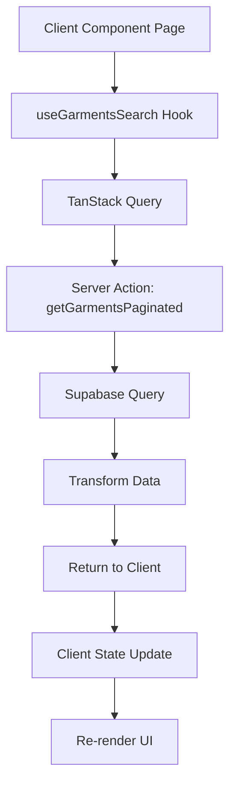
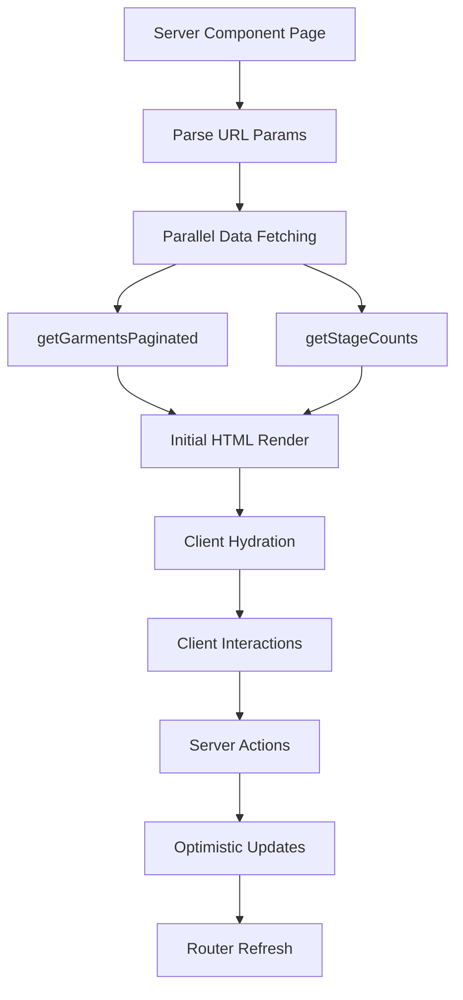

# Garments Page Architecture Refactor

## Executive Summary

This document outlines a comprehensive refactoring strategy for the Threadfolio garments page to align with Next.js 15 best practices and improve performance. The refactor moves from a client-heavy TanStack Query implementation to a server-first approach using Next.js App Router patterns.

**Key Changes:**

- Migrate from Client Component to Server Component for initial rendering
- Replace TanStack Query with Next.js native data fetching patterns
- Implement optimistic UI updates using React 19 features
- Optimize database queries with Supabase functions
- Add proper streaming and suspense boundaries

## Table of Contents

1. [Current State Analysis](#current-state-analysis)
2. [Proposed Architecture](#proposed-architecture)
3. [Implementation Guide](#implementation-guide)
4. [Migration Strategy](#migration-strategy)
5. [Performance Optimizations](#performance-optimizations)
6. [Testing Strategy](#testing-strategy)
7. [Timeline & Milestones](#timeline--milestones)

## Current State Analysis

### Problems with Current Implementation

1. **Entire page is a Client Component** (`'use client'`)
   - No server-side rendering
   - Larger JavaScript bundle (~45KB for garments logic)
   - Additional loading states and spinners
   - Potential hydration mismatches

2. **Complex Client-Side State Management**
   - TanStack Query for data fetching
   - Multiple `useState` hooks for filters
   - Client-side pagination logic
   - Redundant data transformation

3. **Inefficient Database Queries**
   - Separate queries for stage counts
   - View switching based on search
   - Multiple round trips for related data

4. **Inconsistent with Other Pages**
   - Orders page uses superior server-first pattern
   - Different data fetching strategies across app

### Current Data Flow



## Proposed Architecture

### New Data Flow



### Component Structure

```
src/app/(app)/garments/
├── page.tsx                    # Server Component
├── garments-client.tsx         # Client wrapper (minimal)
├── components/
│   ├── garments-list.tsx      # Display component
│   ├── garment-card.tsx       # Individual card
│   ├── stage-filters.tsx      # Filter UI
│   └── search-bar.tsx         # Search UI
├── actions/
│   ├── fetch-garments.ts      # Data fetching
│   └── update-garment.ts      # Mutations
└── loading.tsx                # Loading UI
```

## Implementation Guide

### Step 1: Create Server Component Page

```typescript
// src/app/(app)/garments/page.tsx
import { Suspense } from 'react';
import { ensureUserAndShop } from '@/lib/actions/users';
import { getGarmentsPaginated, getGarmentStageCounts } from './actions/fetch-garments';
import GarmentsClient from './garments-client';
import GarmentsLoading from './loading';
import { Container, Typography, Box } from '@mui/material';

// Force dynamic rendering for fresh data
export const dynamic = 'force-dynamic';

// URL-friendly stage mappings
const urlParamToStage: Record<string, string> = {
  'new': 'New',
  'in-progress': 'In Progress',
  'ready-for-pickup': 'Ready For Pickup',
  'done': 'Done',
};

interface PageProps {
  searchParams: {
    stage?: string;
    search?: string;
    sort?: string;
    order?: 'asc' | 'desc';
    cursor?: string;
  };
}

export default async function GarmentsPage({ searchParams }: PageProps) {
  // Authentication and shop retrieval
  const { shop } = await ensureUserAndShop();

  // Parse URL parameters
  const filters = {
    stage: searchParams.stage ? urlParamToStage[searchParams.stage] : undefined,
    search: searchParams.search,
    sortField: (searchParams.sort || 'created_at') as any,
    sortOrder: searchParams.order || 'desc',
  };

  // Parallel data fetching
  const [garmentsData, stageCounts] = await Promise.all([
    getGarmentsPaginated({
      shopId: shop.id,
      ...filters,
      cursor: searchParams.cursor ? JSON.parse(searchParams.cursor) : undefined,
      limit: 20,
    }),
    getGarmentStageCounts(shop.id),
  ]);

  return (
    <Container maxWidth="xl">
      <Box sx={{ mt: 4, mb: 4 }}>
        <Typography variant="h4" component="h1" gutterBottom>
          Garments
        </Typography>

        <Suspense fallback={<GarmentsLoading />}>
          <GarmentsClient
            initialData={garmentsData}
            stageCounts={stageCounts}
            shopId={shop.id}
            initialFilters={filters}
          />
        </Suspense>
      </Box>
    </Container>
  );
}
```

### Step 2: Create Minimal Client Wrapper

```typescript
// src/app/(app)/garments/garments-client.tsx
'use client';

import { useRouter, usePathname } from 'next/navigation';
import { useTransition, useOptimistic, useState, useCallback } from 'react';
import { useDebounce } from '@/hooks/useDebounce';
import GarmentsList from './components/garments-list';
import StageFilters from './components/stage-filters';
import SearchBar from './components/search-bar';
import { updateGarmentStage } from './actions/update-garment';
import type { PaginatedGarmentsResponse, GarmentListItem } from '@/lib/actions/garments-paginated';

interface GarmentsClientProps {
  initialData: PaginatedGarmentsResponse;
  stageCounts: Record<string, number>;
  shopId: string;
  initialFilters: {
    stage?: string;
    search?: string;
    sortField: string;
    sortOrder: string;
  };
}

export default function GarmentsClient({
  initialData,
  stageCounts,
  shopId,
  initialFilters,
}: GarmentsClientProps) {
  const router = useRouter();
  const pathname = usePathname();
  const [isPending, startTransition] = useTransition();

  // Search state (local for instant feedback)
  const [searchInput, setSearchInput] = useState(initialFilters.search || '');
  const debouncedSearch = useDebounce(searchInput, 300);

  // Optimistic updates for garments
  const [optimisticGarments, updateOptimisticGarments] = useOptimistic(
    initialData.garments,
    (state: GarmentListItem[], { id, updates }: { id: string; updates: Partial<GarmentListItem> }) =>
      state.map(garment => garment.id === id ? { ...garment, ...updates } : garment)
  );

  // Update URL with new filters
  const updateFilters = useCallback((newFilters: Record<string, string | undefined>) => {
    const params = new URLSearchParams();

    Object.entries({ ...initialFilters, ...newFilters }).forEach(([key, value]) => {
      if (value) params.set(key, value);
    });

    router.push(`${pathname}?${params.toString()}`);
  }, [router, pathname, initialFilters]);

  // Handle search changes
  useEffect(() => {
    if (debouncedSearch !== initialFilters.search) {
      updateFilters({ search: debouncedSearch || undefined });
    }
  }, [debouncedSearch, initialFilters.search, updateFilters]);

  // Handle stage update with optimistic UI
  const handleStageUpdate = async (garmentId: string, newStage: string) => {
    startTransition(async () => {
      // Optimistic update
      updateOptimisticGarments({ id: garmentId, updates: { stage: newStage as any } });

      try {
        // Server action
        await updateGarmentStage(shopId, garmentId, newStage as any);

        // Refresh server data
        router.refresh();
      } catch (error) {
        // Error handling - optimistic update will revert
        console.error('Failed to update garment stage:', error);
      }
    });
  };

  // Handle pagination
  const loadMore = () => {
    if (initialData.nextCursor) {
      updateFilters({ cursor: JSON.stringify(initialData.nextCursor) });
    }
  };

  return (
    <>
      {/* Search and Filters */}
      <Box sx={{ mb: 3 }}>
        <Grid container spacing={2} alignItems="center">
          <Grid item xs={12} md={6}>
            <SearchBar
              value={searchInput}
              onChange={setSearchInput}
              placeholder="Search garments..."
            />
          </Grid>
          <Grid item xs={12} md={6}>
            <StageFilters
              selectedStage={initialFilters.stage}
              stageCounts={stageCounts}
              onChange={(stage) => updateFilters({ stage, cursor: undefined })}
            />
          </Grid>
        </Grid>
      </Box>

      {/* Garments List */}
      <GarmentsList
        garments={optimisticGarments}
        isLoading={isPending}
        hasMore={initialData.hasMore}
        onLoadMore={loadMore}
        onStageUpdate={handleStageUpdate}
        totalCount={initialData.totalCount}
      />
    </>
  );
}
```

### Step 3: Optimize Server Actions

```typescript
// src/app/(app)/garments/actions/fetch-garments.ts
'use server';

import { createClient } from '@/lib/supabase/server';
import { unstable_cache } from 'next/cache';
import type {
  GetGarmentsPaginatedParams,
  PaginatedGarmentsResponse,
} from '@/lib/actions/garments-paginated';

// Cache stage counts for 60 seconds
export const getGarmentStageCounts = unstable_cache(
  async (shopId: string): Promise<Record<string, number>> => {
    const supabase = await createClient();

    // Use a single query with aggregation
    const { data, error } = await supabase.rpc('get_garment_stage_counts', {
      p_shop_id: shopId,
    });

    if (error) throw error;

    return data.reduce((acc: Record<string, number>, row: any) => {
      acc[row.stage] = row.count;
      return acc;
    }, {});
  },
  ['garment-stage-counts'],
  { revalidate: 60 }
);

// Optimized garments fetch
export async function getGarmentsPaginated(
  params: GetGarmentsPaginatedParams
): Promise<PaginatedGarmentsResponse> {
  const supabase = await createClient();

  // Use database function for complex query
  const { data, error } = await supabase.rpc('get_garments_paginated', {
    p_shop_id: params.shopId,
    p_stage: params.stage,
    p_search: params.search,
    p_sort_field: params.sortField,
    p_sort_order: params.sortOrder,
    p_limit: params.limit,
    p_cursor: params.cursor,
  });

  if (error) throw error;

  return data;
}
```

### Step 4: Create Database Functions

```sql
-- migrations/add_garments_optimizations.sql

-- Function for stage counts
CREATE OR REPLACE FUNCTION get_garment_stage_counts(p_shop_id UUID)
RETURNS TABLE (stage garment_stage_enum, count BIGINT)
LANGUAGE plpgsql
AS $$
BEGIN
  RETURN QUERY
  SELECT
    g.stage,
    COUNT(*)::BIGINT
  FROM garments g
  WHERE g.shop_id = p_shop_id
  GROUP BY g.stage;
END;
$$;

-- Optimized paginated garments function
CREATE OR REPLACE FUNCTION get_garments_paginated(
  p_shop_id UUID,
  p_stage garment_stage_enum DEFAULT NULL,
  p_search TEXT DEFAULT NULL,
  p_sort_field TEXT DEFAULT 'created_at',
  p_sort_order TEXT DEFAULT 'desc',
  p_limit INT DEFAULT 20,
  p_cursor JSONB DEFAULT NULL
)
RETURNS JSONB
LANGUAGE plpgsql
AS $$
DECLARE
  v_garments JSONB;
  v_total_count INT;
  v_has_more BOOLEAN;
  v_next_cursor JSONB;
BEGIN
  -- Main query with CTEs for efficiency
  WITH filtered_garments AS (
    SELECT
      g.*,
      c.first_name AS client_first_name,
      c.last_name AS client_last_name,
      CONCAT(c.first_name, ' ', c.last_name) AS client_full_name
    FROM garments g
    LEFT JOIN orders o ON g.order_id = o.id
    LEFT JOIN clients c ON o.client_id = c.id
    WHERE
      g.shop_id = p_shop_id
      AND (p_stage IS NULL OR g.stage = p_stage)
      AND (
        p_search IS NULL
        OR g.name ILIKE '%' || p_search || '%'
        OR g.notes ILIKE '%' || p_search || '%'
        OR c.first_name ILIKE '%' || p_search || '%'
        OR c.last_name ILIKE '%' || p_search || '%'
      )
  ),
  paginated AS (
    SELECT *
    FROM filtered_garments
    ORDER BY
      CASE
        WHEN p_sort_field = 'due_date' THEN due_date
        WHEN p_sort_field = 'created_at' THEN created_at
        WHEN p_sort_field = 'name' THEN name
        WHEN p_sort_field = 'client_name' THEN client_full_name
      END
    LIMIT p_limit + 1
  )
  SELECT
    jsonb_build_object(
      'garments', jsonb_agg(row_to_json(p.*) ORDER BY p.created_at),
      'hasMore', COUNT(*) > p_limit,
      'totalCount', (SELECT COUNT(*) FROM filtered_garments)
    ) INTO v_garments
  FROM paginated p
  LIMIT p_limit;

  RETURN v_garments;
END;
$$;

-- Add indexes for performance
CREATE INDEX IF NOT EXISTS idx_garments_shop_stage ON garments(shop_id, stage);
CREATE INDEX IF NOT EXISTS idx_garments_search ON garments USING gin(to_tsvector('english', name || ' ' || COALESCE(notes, '')));
```

### Step 5: Implement Loading States

```typescript
// src/app/(app)/garments/loading.tsx
import { Skeleton, Box, Grid } from '@mui/material';

export default function GarmentsLoading() {
  return (
    <Box>
      {/* Search and Filter Skeletons */}
      <Box sx={{ mb: 3 }}>
        <Grid container spacing={2}>
          <Grid item xs={12} md={6}>
            <Skeleton variant="rectangular" height={56} />
          </Grid>
          <Grid item xs={12} md={6}>
            <Skeleton variant="rectangular" height={56} />
          </Grid>
        </Grid>
      </Box>

      {/* Garment Card Skeletons */}
      <Grid container spacing={2}>
        {Array.from({ length: 6 }).map((_, index) => (
          <Grid item xs={12} sm={6} md={4} key={index}>
            <Skeleton variant="rectangular" height={200} sx={{ borderRadius: 2 }} />
          </Grid>
        ))}
      </Grid>
    </Box>
  );
}
```

## Migration Strategy

### Phase 1: Preparation (1 day)

1. Create new server component structure alongside existing
2. Set up database functions and indexes
3. Create comprehensive test suite

### Phase 2: Implementation (2-3 days)

1. Implement server component page
2. Create minimal client wrapper
3. Migrate subcomponents one by one
4. Update server actions for optimizations

### Phase 3: Testing & Validation (1 day)

1. Run parallel testing with feature flag
2. Performance benchmarking
3. User acceptance testing

### Phase 4: Rollout (1 day)

1. Deploy behind feature flag
2. Gradual rollout to users
3. Monitor performance metrics
4. Full migration

### Rollback Plan

- Keep existing implementation intact during migration
- Use feature flag for easy rollback
- Monitor error rates and performance metrics

## Performance Optimizations

### Expected Improvements

1. **Initial Page Load**
   - Current: ~2.5s (client-side fetch)
   - Target: <1s (server-rendered)

2. **JavaScript Bundle**
   - Current: ~245KB (with TanStack Query)
   - Target: ~180KB (65KB reduction)

3. **Time to Interactive**
   - Current: ~3s
   - Target: <1.5s

### Caching Strategy

```typescript
// Edge caching for static assets
export const runtime = 'edge';

// Stale-while-revalidate for data
headers: {
  'Cache-Control': 's-maxage=60, stale-while-revalidate=300'
}
```

### Database Optimizations

1. **Indexes**: Add composite indexes for common query patterns
2. **Views**: Create materialized views for complex aggregations
3. **Functions**: Use PL/pgSQL for complex queries
4. **Connection Pooling**: Optimize Supabase connection settings

## Testing Strategy

### Unit Tests

```typescript
// __tests__/garments/fetch-garments.test.ts
import { getGarmentsPaginated } from '@/app/(app)/garments/actions/fetch-garments';

describe('getGarmentsPaginated', () => {
  it('should fetch garments with proper filtering', async () => {
    const result = await getGarmentsPaginated({
      shopId: 'test-shop-id',
      stage: 'New',
      limit: 20,
    });

    expect(result.garments).toHaveLength(20);
    expect(result.garments.every((g) => g.stage === 'New')).toBe(true);
  });

  it('should handle search correctly', async () => {
    const result = await getGarmentsPaginated({
      shopId: 'test-shop-id',
      search: 'wedding',
      limit: 10,
    });

    expect(
      result.garments.some(
        (g) =>
          g.name.toLowerCase().includes('wedding') ||
          g.notes?.toLowerCase().includes('wedding')
      )
    ).toBe(true);
  });
});
```

### Integration Tests

```typescript
// __tests__/e2e/garments-page.test.ts
import { test, expect } from '@playwright/test';

test.describe('Garments Page', () => {
  test('should load and display garments', async ({ page }) => {
    await page.goto('/garments');

    // Wait for garments to load
    await expect(
      page.locator('[data-testid="garment-card"]').first()
    ).toBeVisible();

    // Test filtering
    await page.click('[data-testid="stage-filter-new"]');
    await page.waitForURL(/stage=new/);

    // Verify filtered results
    const garments = await page
      .locator('[data-testid="garment-stage"]')
      .allTextContents();
    expect(garments.every((stage) => stage === 'New')).toBe(true);
  });
});
```

### Performance Tests

```typescript
// __tests__/performance/garments.perf.ts
import { measurePerformance } from '@/test-utils/performance';

test('Garments page performance', async () => {
  const metrics = await measurePerformance('/garments');

  expect(metrics.fcp).toBeLessThan(1000); // First Contentful Paint < 1s
  expect(metrics.lcp).toBeLessThan(2000); // Largest Contentful Paint < 2s
  expect(metrics.tti).toBeLessThan(3000); // Time to Interactive < 3s
});
```

## Timeline & Milestones

### Week 1

- [ ] Day 1: Setup and preparation
- [ ] Day 2-3: Core implementation
- [ ] Day 4: Testing and debugging
- [ ] Day 5: Performance optimization

### Week 2

- [ ] Day 1-2: Integration testing
- [ ] Day 3: Staging deployment
- [ ] Day 4: Production rollout (10%)
- [ ] Day 5: Full production rollout

### Success Metrics

1. **Performance**
   - Page load time < 1s
   - JavaScript bundle reduced by 25%
   - Core Web Vitals all green

2. **User Experience**
   - No visible loading spinners on navigation
   - Instant search feedback
   - Smooth stage transitions

3. **Developer Experience**
   - Simplified codebase
   - Consistent with other pages
   - Easier to test and maintain

## Conclusion

This refactor aligns the garments page with Next.js 15 best practices and the patterns already established in the orders page. The server-first approach with minimal client-side state will improve performance, reduce complexity, and provide a better user experience.

The migration can be completed safely with minimal risk using feature flags and comprehensive testing. The expected performance improvements justify the development effort, and the resulting architecture will be more maintainable long-term.
