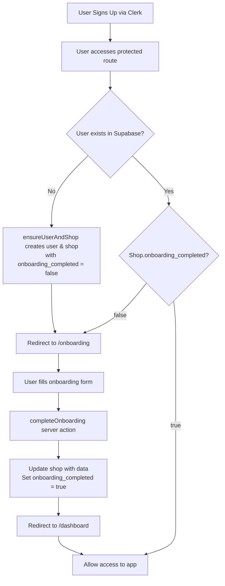

# Onboarding Infinite Loop Fix Summary

## Problem

New users were getting stuck in an infinite loop on the onboarding page in production. The issue was that:

1. The `/onboarding` page was inside the `(app)` layout
2. The `(app)` layout checks if the user exists in Supabase
3. If not found, it redirects to `/onboarding`
4. But `/onboarding` uses the same layout, causing an infinite loop

## Solution Implemented

### 1. Database Changes

- Added `onboarding_completed` boolean flag to the `shops` table
- Migration file: `supabase/migrations/20250224_add_onboarding_completed_flag.sql`

### 2. Code Structure Changes

#### Separated Onboarding Layout

- Moved `/onboarding` from `(app)` route group to `(onboarding)` route group
- Created a simple layout for onboarding that doesn't check user/shop existence
- This prevents the infinite redirect loop

#### Updated Authentication Flow

- `ensureUserAndShop` now sets `onboarding_completed: false` for new shops
- App layout checks `onboarding_completed` flag and redirects to onboarding if false
- Onboarding page properly saves user data and marks onboarding as complete

### 3. Key Files Modified

1. **Migration**: `supabase/migrations/20250224_add_onboarding_completed_flag.sql`
2. **Auth Logic**: `src/lib/auth/user-shop.ts`
3. **App Layout**: `src/app/(app)/layout.tsx`
4. **Onboarding Layout**: `src/app/(onboarding)/layout.tsx` (new)
5. **Onboarding Page**: `src/app/(onboarding)/onboarding/page.tsx`
6. **Server Action**: `src/lib/actions/onboarding.ts` (new)
7. **Type Definitions**: `src/types/supabase.ts`

## Flow Diagram



## Deployment Steps

1. **Run the database migration** in your Supabase project:

   ```sql
   -- Add onboarding_completed flag to shops table
   ALTER TABLE shops
   ADD COLUMN IF NOT EXISTS onboarding_completed BOOLEAN DEFAULT FALSE;

   -- Set existing shops as onboarding completed
   UPDATE shops
   SET onboarding_completed = TRUE
   WHERE onboarding_completed IS FALSE;
   ```

2. **Deploy the code changes** to production

3. **Test the flow**:
   - Sign up as a new user
   - Verify automatic redirect to onboarding
   - Fill out onboarding form
   - Verify redirect to dashboard
   - Verify no infinite loops

## Required vs Optional Fields

### Required Fields (must be filled during onboarding)

- Business Name

### Optional Fields (can be added later)

- Email
- Phone Number
- Mailing Address
- Location Type
- Working Hours
- Payment Preference

## Benefits

1. **No More Infinite Loops**: Onboarding page is outside the main app layout
2. **Better User Experience**: New users are automatically directed to complete onboarding
3. **Flexible Data Collection**: Only business name is required, other info can be added later
4. **Automatic Trial Setup**: 14-day trial is set when onboarding completes
5. **Existing Users Unaffected**: Migration marks existing shops as onboarding completed
