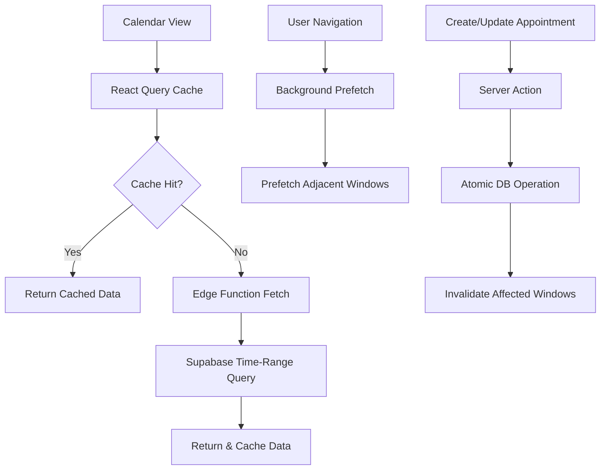

# Calendar & Appointments Refactoring Architecture

## Executive Summary

This document outlines the architectural refactoring of the Threadfolio V2 calendar and appointment booking system to efficiently handle hundreds of thousands of appointments using time-range queries, React Query caching, Next.js 15 Server Actions, and Edge Runtime optimization.

## Core Architecture Principles

### 1. Sliding Window Fetching Pattern

Instead of loading all appointments or using cursor-based pagination, we implement a sliding window approach:

- **Fixed Time Ranges**: Month/Week/Day views define predictable query boundaries
- **Three-Window Memory**: Keep previous, current, and next windows in cache
- **Background Prefetching**: Load adjacent windows before user navigation
- **Memory Efficient**: Old windows are garbage collected automatically

### 2. Data Flow Architecture



## Technical Implementation

### 1. Database Optimization

#### Enhanced Indexes

```sql
-- Drop existing suboptimal indexes
DROP INDEX IF EXISTS idx_appointments_shop_date;
DROP INDEX IF EXISTS idx_appointments_date_range;

-- Create optimized composite indexes for time-range queries
CREATE INDEX idx_appointments_shop_date_time
ON appointments(shop_id, date, start_time, end_time)
WHERE status NOT IN ('cancelled', 'no_show');

-- Index for month view queries
CREATE INDEX idx_appointments_shop_month
ON appointments(shop_id, date)
WHERE status NOT IN ('cancelled', 'no_show');

-- Index for client-specific queries
CREATE INDEX idx_appointments_shop_client_date
ON appointments(shop_id, client_id, date)
WHERE status NOT IN ('cancelled', 'no_show');

-- Partial index for active appointments only
CREATE INDEX idx_appointments_active
ON appointments(shop_id, date, start_time)
WHERE status IN ('scheduled', 'confirmed');

-- Add BRIN index for very large datasets
CREATE INDEX idx_appointments_date_brin
ON appointments USING BRIN(date);
```

### 2. React Query Integration

#### Query Keys Structure

```typescript
// src/lib/queries/appointment-keys.ts
export const appointmentKeys = {
  all: ['appointments'] as const,
  lists: () => [...appointmentKeys.all, 'list'] as const,
  list: (filters: AppointmentFilters) =>
    [...appointmentKeys.lists(), filters] as const,

  // Time-range specific keys
  timeRange: (shopId: string, startDate: string, endDate: string) =>
    [...appointmentKeys.all, 'timeRange', shopId, startDate, endDate] as const,

  // View-specific keys
  monthView: (shopId: string, year: number, month: number) =>
    [...appointmentKeys.all, 'month', shopId, year, month] as const,

  weekView: (shopId: string, year: number, week: number) =>
    [...appointmentKeys.all, 'week', shopId, year, week] as const,

  dayView: (shopId: string, date: string) =>
    [...appointmentKeys.all, 'day', shopId, date] as const,
};
```

#### Query Configuration

```typescript
// src/lib/queries/appointment-queries.ts
import { useQuery, useQueryClient, useMutation } from '@tanstack/react-query';
import { getAppointmentsByTimeRange } from '@/lib/actions/appointments';

// Stale time configuration
const APPOINTMENT_STALE_TIME = 5 * 60 * 1000; // 5 minutes
const APPOINTMENT_CACHE_TIME = 30 * 60 * 1000; // 30 minutes

export function useAppointmentsTimeRange(
  shopId: string,
  startDate: string,
  endDate: string,
  options?: UseQueryOptions
) {
  return useQuery({
    queryKey: appointmentKeys.timeRange(shopId, startDate, endDate),
    queryFn: () => getAppointmentsByTimeRange(shopId, startDate, endDate),
    staleTime: APPOINTMENT_STALE_TIME,
    cacheTime: APPOINTMENT_CACHE_TIME,
    ...options,
  });
}

// Background prefetching hook
export function usePrefetchAdjacentWindows(
  shopId: string,
  currentDate: Date,
  view: 'month' | 'week' | 'day'
) {
  const queryClient = useQueryClient();

  useEffect(() => {
    const prefetchWindows = async () => {
      const { prevStart, prevEnd, nextStart, nextEnd } =
        calculateAdjacentWindows(currentDate, view);

      // Prefetch previous window
      queryClient.prefetchQuery({
        queryKey: appointmentKeys.timeRange(shopId, prevStart, prevEnd),
        queryFn: () => getAppointmentsByTimeRange(shopId, prevStart, prevEnd),
        staleTime: APPOINTMENT_STALE_TIME,
      });

      // Prefetch next window
      queryClient.prefetchQuery({
        queryKey: appointmentKeys.timeRange(shopId, nextStart, nextEnd),
        queryFn: () => getAppointmentsByTimeRange(shopId, nextStart, nextEnd),
        staleTime: APPOINTMENT_STALE_TIME,
      });
    };

    prefetchWindows();
  }, [shopId, currentDate, view, queryClient]);
}
```

### 3. Server Actions (Write Operations)

```typescript
// src/lib/actions/appointments-mutations.ts
'use server';

import { z } from 'zod';
import { revalidatePath } from 'next/cache';
import { createClient } from '@/lib/supabase/server';

const createAppointmentSchema = z.object({
  clientId: z.string().uuid().optional(),
  title: z.string().min(1),
  date: z.string(),
  startTime: z.string(),
  endTime: z.string(),
  type: z.enum(['consultation', 'fitting', 'pickup', 'delivery', 'other']),
  notes: z.string().optional(),
});

export async function createAppointment(
  data: z.infer<typeof createAppointmentSchema>
) {
  const validated = createAppointmentSchema.parse(data);
  const supabase = await createClient();

  // Atomic operation with conflict checking
  const { data: appointment, error } = await supabase.rpc(
    'create_appointment_atomic',
    {
      p_shop_id: shopId,
      p_client_id: validated.clientId,
      p_title: validated.title,
      p_date: validated.date,
      p_start_time: validated.startTime,
      p_end_time: validated.endTime,
      p_type: validated.type,
      p_notes: validated.notes,
    }
  );

  if (error) {
    if (error.code === 'P0001') {
      throw new Error('Time slot conflict detected');
    }
    throw new Error('Failed to create appointment');
  }

  // Revalidate the appointments page
  revalidatePath('/appointments');

  return appointment;
}
```

### 4. Edge Functions (Read Operations)

```typescript
// src/app/api/appointments/time-range/route.ts
import { NextRequest } from 'next/server';
import { createClient } from '@/lib/supabase/server';

export const runtime = 'edge';

// Cache configuration
const revalidate = 300; // 5 minutes

export async function GET(request: NextRequest) {
  const searchParams = request.nextUrl.searchParams;
  const shopId = searchParams.get('shopId');
  const startDate = searchParams.get('startDate');
  const endDate = searchParams.get('endDate');

  if (!shopId || !startDate || !endDate) {
    return Response.json({ error: 'Missing parameters' }, { status: 400 });
  }

  const supabase = await createClient();

  // Optimized query with proper indexes
  const { data, error } = await supabase
    .from('appointments')
    .select(
      `
      id,
      title,
      date,
      start_time,
      end_time,
      type,
      status,
      client:clients!appointments_client_id_fkey(
        id,
        first_name,
        last_name
      )
    `
    )
    .eq('shop_id', shopId)
    .gte('date', startDate)
    .lte('date', endDate)
    .in('status', ['scheduled', 'confirmed'])
    .order('date', { ascending: true })
    .order('start_time', { ascending: true });

  if (error) {
    return Response.json({ error: error.message }, { status: 500 });
  }

  return Response.json(data, {
    headers: {
      'Cache-Control': `s-maxage=${revalidate}, stale-while-revalidate`,
    },
  });
}
```

### 5. Optimized Calendar Components

```typescript
// src/components/appointments/CalendarWithQuery.tsx
'use client';

import { useMemo } from 'react';
import { format, startOfMonth, endOfMonth } from 'date-fns';
import { useAppointmentsTimeRange, usePrefetchAdjacentWindows } from '@/lib/queries/appointment-queries';
import { CalendarView } from './CalendarView';

interface CalendarWithQueryProps {
  shopId: string;
  initialDate: Date;
  view: 'month' | 'week' | 'day';
}

export function CalendarWithQuery({
  shopId,
  initialDate,
  view
}: CalendarWithQueryProps) {
  const [currentDate, setCurrentDate] = useState(initialDate);

  // Calculate date range based on view
  const { startDate, endDate } = useMemo(() =>
    calculateDateRange(currentDate, view), [currentDate, view]
  );

  // Fetch current window
  const { data: appointments, isLoading } = useAppointmentsTimeRange(
    shopId,
    startDate,
    endDate
  );

  // Prefetch adjacent windows
  usePrefetchAdjacentWindows(shopId, currentDate, view);

  const handleNavigate = (direction: 'prev' | 'next') => {
    const newDate = calculateNewDate(currentDate, view, direction);
    setCurrentDate(newDate);
  };

  if (isLoading) {
    return <CalendarSkeleton view={view} />;
  }

  return (
    <CalendarView
      appointments={appointments || []}
      currentDate={currentDate}
      view={view}
      onNavigate={handleNavigate}
    />
  );
}
```

### 6. Mutation with Optimistic Updates

```typescript
// src/hooks/useCreateAppointment.ts
export function useCreateAppointment() {
  const queryClient = useQueryClient();
  const { shopId } = useAuth();

  return useMutation({
    mutationFn: createAppointment,

    // Optimistic update
    onMutate: async (newAppointment) => {
      const { startDate, endDate } = calculateDateRange(
        new Date(newAppointment.date),
        'month'
      );

      const queryKey = appointmentKeys.timeRange(shopId, startDate, endDate);

      // Cancel outgoing refetches
      await queryClient.cancelQueries({ queryKey });

      // Snapshot previous value
      const previousAppointments = queryClient.getQueryData(queryKey);

      // Optimistically update
      queryClient.setQueryData(queryKey, (old: Appointment[] = []) => {
        const optimisticAppointment = {
          ...newAppointment,
          id: `temp-${Date.now()}`,
          status: 'scheduled',
          created_at: new Date().toISOString(),
        };
        return [...old, optimisticAppointment].sort(sortByDateTime);
      });

      return { previousAppointments, queryKey };
    },

    // Handle error
    onError: (err, newAppointment, context) => {
      if (context?.previousAppointments) {
        queryClient.setQueryData(
          context.queryKey,
          context.previousAppointments
        );
      }
    },

    // Always refetch after error or success
    onSettled: (data, error, variables) => {
      const { startDate, endDate } = calculateDateRange(
        new Date(variables.date),
        'month'
      );

      queryClient.invalidateQueries({
        queryKey: appointmentKeys.timeRange(shopId, startDate, endDate),
      });
    },
  });
}
```

## Performance Optimizations

### 1. Database Functions

```sql
-- Atomic appointment creation with conflict detection
CREATE OR REPLACE FUNCTION create_appointment_atomic(
  p_shop_id UUID,
  p_client_id UUID,
  p_title TEXT,
  p_date DATE,
  p_start_time TIME,
  p_end_time TIME,
  p_type TEXT,
  p_notes TEXT DEFAULT NULL
)
RETURNS appointments
LANGUAGE plpgsql
AS $$
DECLARE
  v_appointment appointments;
  v_conflict_exists BOOLEAN;
BEGIN
  -- Check for conflicts in a single query
  SELECT check_appointment_conflict(
    p_shop_id,
    p_date,
    p_start_time,
    p_end_time
  ) INTO v_conflict_exists;

  IF v_conflict_exists THEN
    RAISE EXCEPTION 'Time slot conflict' USING ERRCODE = 'P0001';
  END IF;

  -- Create appointment
  INSERT INTO appointments (
    shop_id, client_id, title, date,
    start_time, end_time, type, notes
  ) VALUES (
    p_shop_id, p_client_id, p_title, p_date,
    p_start_time, p_end_time, p_type, p_notes
  )
  RETURNING * INTO v_appointment;

  RETURN v_appointment;
END;
$$;
```

### 2. Query Optimization

```typescript
// src/lib/utils/calendar-performance.ts
export const CALENDAR_CONFIG = {
  // Fetch configuration
  BATCH_SIZE: 100, // Max appointments per query
  PREFETCH_DELAY: 100, // Delay before prefetching (ms)

  // Cache configuration
  STALE_TIME: {
    month: 5 * 60 * 1000, // 5 minutes
    week: 3 * 60 * 1000, // 3 minutes
    day: 1 * 60 * 1000, // 1 minute
  },

  CACHE_TIME: {
    month: 30 * 60 * 1000, // 30 minutes
    week: 15 * 60 * 1000, // 15 minutes
    day: 5 * 60 * 1000, // 5 minutes
  },

  // Memory management
  MAX_CACHED_WINDOWS: 5, // Maximum windows to keep in cache
};

// Garbage collection for old queries
export function setupQueryGarbageCollection(queryClient: QueryClient) {
  setInterval(
    () => {
      const queries = queryClient.getQueryCache().getAll();
      const now = Date.now();

      queries
        .filter((query) => {
          const queryKey = query.queryKey;
          return (
            Array.isArray(queryKey) &&
            queryKey[0] === 'appointments' &&
            query.state.dataUpdatedAt < now - CALENDAR_CONFIG.CACHE_TIME.month
          );
        })
        .forEach((query) => {
          queryClient.removeQueries({ queryKey: query.queryKey });
        });
    },
    5 * 60 * 1000
  ); // Run every 5 minutes
}
```

## Migration Strategy

### Phase 1: Infrastructure (Week 1)

1. Add React Query dependency
2. Create database indexes
3. Set up Edge Runtime routes
4. Create atomic database functions

### Phase 2: Core Implementation (Week 2)

1. Implement React Query hooks
2. Create Server Actions for mutations
3. Build sliding window logic
4. Add prefetching mechanism

### Phase 3: UI Integration (Week 3)

1. Refactor calendar components
2. Add loading skeletons
3. Implement error boundaries
4. Add optimistic updates

### Phase 4: Testing & Optimization (Week 4)

1. Load testing with large datasets
2. Performance profiling
3. Cache tuning
4. Edge case handling

## Monitoring & Observability

```typescript
// src/lib/monitoring/calendar-metrics.ts
export function trackCalendarPerformance() {
  // Track query performance
  queryClient.getQueryCache().subscribe((event) => {
    if (event.type === 'observerResultsUpdated') {
      const { query } = event;
      if (query.queryKey[0] === 'appointments') {
        analytics.track('calendar_query', {
          queryKey: query.queryKey,
          dataUpdatedAt: query.state.dataUpdatedAt,
          fetchStatus: query.state.fetchStatus,
          loadTime: query.state.fetchMeta?.duration,
        });
      }
    }
  });

  // Track cache hit rate
  let cacheHits = 0;
  let cacheMisses = 0;

  queryClient.getQueryCache().subscribe((event) => {
    if (event.type === 'observerResultsUpdated') {
      if (event.query.state.data && !event.query.state.isFetching) {
        cacheHits++;
      } else if (event.query.state.isFetching) {
        cacheMisses++;
      }

      // Report metrics every minute
      if ((cacheHits + cacheMisses) % 100 === 0) {
        const hitRate = cacheHits / (cacheHits + cacheMisses);
        analytics.track('cache_performance', {
          hitRate,
          totalQueries: cacheHits + cacheMisses,
        });
      }
    }
  });
}
```

## Success Metrics

1. **Performance Targets**
   - Initial calendar load: < 200ms (cached), < 500ms (uncached)
   - Navigation between views: < 50ms (prefetched)
   - Appointment creation: < 300ms perceived latency

2. **Scalability Targets**
   - Support 1M+ appointments per shop
   - Handle 1000+ concurrent users
   - Maintain < 100ms p95 query time

3. **User Experience**
   - Zero loading spinners during navigation
   - Instant appointment creation feedback
   - Smooth scrolling and interactions

## Conclusion

This architecture provides a production-ready solution for handling large-scale appointment data with excellent performance and user experience. The combination of time-range queries, React Query caching, and background prefetching creates a seamless calendar experience that scales efficiently.
