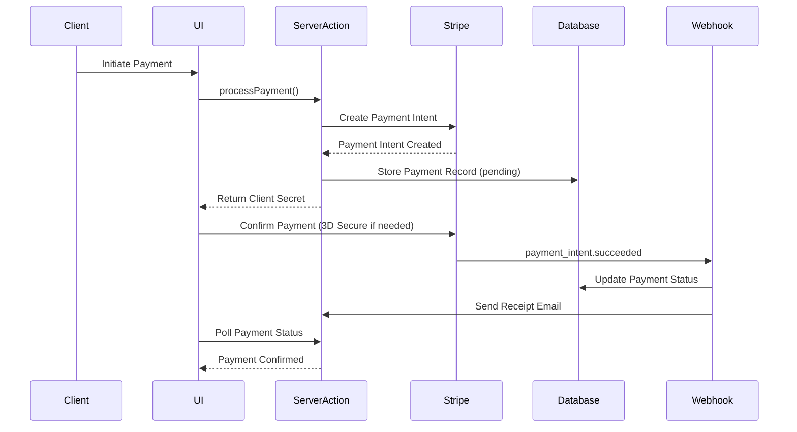
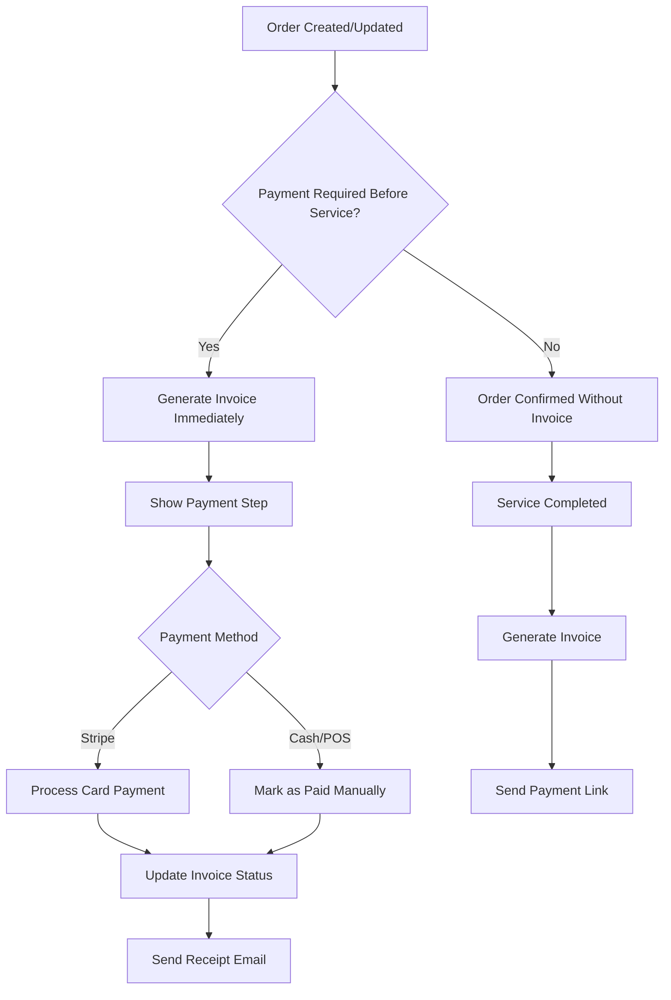

# Invoice Management Technical Architecture

_Last updated: January 2025_

## Executive Summary

This document provides the comprehensive technical architecture for Hemsy's Invoice Management feature, integrating payment processing capabilities into the existing mobile-first PWA architecture. The design supports flexible payment timing models (before/after service), multiple payment methods (Stripe, cash, external POS), and maintains consistency with Hemsy's existing patterns.

## Table of Contents

1. [System Context](#system-context)
2. [Feature Architecture Overview](#feature-architecture-overview)
3. [Component Architecture](#component-architecture)
4. [Data Flow Architecture](#data-flow-architecture)
5. [Integration Architecture](#integration-architecture)
6. [State Management Strategy](#state-management-strategy)
7. [Error Handling Architecture](#error-handling-architecture)
8. [Testing Architecture](#testing-architecture)
9. [Performance Architecture](#performance-architecture)
10. [Deployment Architecture](#deployment-architecture)

## System Context

### Integration Points with Existing System

```text
┌─────────────────────────────────────────────────────────────┐
│                    Hemsy App (PWA)                    │
├─────────────────────────────────────────────────────────────┤
│  ┌──────────────┐  ┌──────────────┐  ┌─────────────────┐  │
│  │   Orders     │  │   Clients    │  │    Settings     │  │
│  │  Component   │  │  Component   │  │   Component     │  │
│  └──────┬───────┘  └──────┬───────┘  └────────┬────────┘  │
│         │                  │                    │           │
│  ┌──────┴──────────────────┴───────────────────┴────────┐  │
│  │              Invoice Management Layer                 │  │
│  │  ┌─────────────┐  ┌──────────────┐  ┌────────────┐  │  │
│  │  │   Invoice   │  │   Payment    │  │  Payment   │  │  │
│  │  │  Generator  │  │  Processor   │  │   Links    │  │  │
│  │  └─────────────┘  └──────────────┘  └────────────┘  │  │
│  └───────────────────────┬──────────────────────────────┘  │
└─────────────────────────────────────────────────────────────┘
                          │
                          ▼
┌─────────────────────────────────────────────────────────────┐
│                    Server Actions Layer                      │
│  ┌──────────────┐  ┌──────────────┐  ┌─────────────────┐  │
│  │   Invoice    │  │   Payment    │  │    Webhook      │  │
│  │   Actions    │  │   Actions    │  │   Handlers      │  │
│  └──────┬───────┘  └──────┬───────┘  └────────┬────────┘  │
└─────────────────────────────────────────────────────────────┘
          │                  │                    │
          ▼                  ▼                    ▼
┌─────────────────────────────────────────────────────────────┐
│                      Data & Services                         │
│  ┌──────────────┐  ┌──────────────┐  ┌─────────────────┐  │
│  │   Supabase   │  │    Stripe    │  │     Resend      │  │
│  │  (Invoices,  │  │  (Payments)  │  │    (Emails)     │  │
│  │   Payments)  │  │              │  │                 │  │
│  └──────────────┘  └──────────────┘  └─────────────────┘  │
└─────────────────────────────────────────────────────────────┘
```

## Feature Architecture Overview

### Core Architectural Decisions

1. **Server-First Payment Processing**: All payment operations execute through Server Actions to maintain security and consistency
2. **Webhook-Driven State Synchronization**: Stripe webhooks serve as the source of truth for payment state
3. **Optimistic UI with Rollback**: Provide immediate feedback with proper error recovery
4. **Mobile-First Form Design**: Touch-optimized payment forms with progressive enhancement
5. **Transactional Integrity**: Database operations wrapped in transactions for consistency

### Key Components

```typescript
// Core component structure
src/
├── components/
│   ├── invoices/
│   │   ├── InvoiceList.tsx
│   │   ├── InvoiceDetail.tsx
│   │   ├── InvoiceGenerator.tsx
│   │   └── InvoiceStatusBadge.tsx
│   ├── payments/
│   │   ├── PaymentForm.tsx
│   │   ├── PaymentMethodSelector.tsx
│   │   ├── StripePaymentElement.tsx
│   │   └── ManualPaymentDialog.tsx
│   └── payment-links/
│       ├── PaymentLinkGenerator.tsx
│       └── PublicPaymentPage.tsx
├── lib/
│   ├── actions/
│   │   ├── invoices.ts
│   │   ├── payments.ts
│   │   └── payment-links.ts
│   ├── services/
│   │   ├── stripe/
│   │   │   ├── client.ts
│   │   │   ├── payment-intents.ts
│   │   │   └── payment-links.ts
│   │   └── invoice/
│   │       ├── generator.ts
│   │       └── number-sequence.ts
│   └── hooks/
│       ├── useInvoice.ts
│       ├── usePaymentStatus.ts
│       └── useStripeElements.ts
└── app/
    ├── api/
    │   └── webhooks/
    │       └── stripe/
    │           └── route.ts
    └── pay/
        └── [token]/
            └── page.tsx
```

## Component Architecture

### Invoice Components

```typescript
// Invoice Generator Component
interface InvoiceGeneratorProps {
  orderId: string;
  shopSettings: ShopSettings;
  onSuccess: (invoice: Invoice) => void;
}

const InvoiceGenerator: FC<InvoiceGeneratorProps> = ({
  orderId,
  shopSettings,
  onSuccess,
}) => {
  // Component integrates with order data
  // Generates invoice based on shop settings
  // Handles payment timing logic
};

// Invoice Status Badge Component
interface InvoiceStatusBadgeProps {
  status: 'pending' | 'paid' | 'cancelled';
  paymentMethod?: 'stripe' | 'cash' | 'external_pos';
}

const InvoiceStatusBadge: FC<InvoiceStatusBadgeProps> = ({
  status,
  paymentMethod,
}) => {
  // Visual status indicator
  // Consistent with Material UI theme
  // Mobile-optimized touch targets
};
```

### Payment Components

```typescript
// Stripe Payment Element Integration
interface StripePaymentElementProps {
  invoice: Invoice;
  onSuccess: (paymentIntent: PaymentIntent) => void;
  onError: (error: StripeError) => void;
}

const StripePaymentElement: FC<StripePaymentElementProps> = ({
  invoice,
  onSuccess,
  onError,
}) => {
  // Stripe Elements integration
  // 3D Secure handling
  // Mobile-optimized form fields
  // Real-time validation
};

// Payment Method Selector
interface PaymentMethodSelectorProps {
  availableMethods: PaymentMethod[];
  onSelect: (method: PaymentMethod) => void;
}

const PaymentMethodSelector: FC<PaymentMethodSelectorProps> = ({
  availableMethods,
  onSelect,
}) => {
  // Dynamic based on shop settings
  // Clear visual indicators
  // Accessible selection UI
};
```

## Data Flow Architecture

### Payment Processing Flow



### Invoice Generation Flow



## Integration Architecture

### Stripe Integration Strategy

```typescript
// Stripe Service Layer
export class StripePaymentService {
  private stripe: Stripe;

  constructor() {
    this.stripe = new Stripe(process.env.STRIPE_SECRET_KEY!, {
      apiVersion: '2023-10-16',
      typescript: true,
    });
  }

  async createPaymentIntent(invoice: Invoice): Promise<PaymentIntent> {
    return await this.stripe.paymentIntents.create({
      amount: invoice.amount_cents,
      currency: 'usd',
      metadata: {
        invoice_id: invoice.id,
        order_id: invoice.order_id,
        shop_id: invoice.shop_id,
      },
      automatic_payment_methods: {
        enabled: true,
      },
    });
  }

  async createPaymentLink(invoice: Invoice): Promise<PaymentLink> {
    return await this.stripe.paymentLinks.create({
      line_items: [
        {
          price_data: {
            currency: 'usd',
            product_data: {
              name: `Invoice ${invoice.number}`,
              description: invoice.description,
            },
            unit_amount: invoice.amount_cents,
          },
          quantity: 1,
        },
      ],
      metadata: {
        invoice_id: invoice.id,
      },
      after_completion: {
        type: 'redirect',
        redirect: {
          url: `${process.env.NEXT_PUBLIC_APP_URL}/invoices/${invoice.id}/success`,
        },
      },
      expires_at: Math.floor(Date.now() / 1000) + 24 * 60 * 60, // 24 hours
    });
  }
}
```

### Webhook Handler Architecture

```typescript
// Webhook Handler with Signature Verification
export async function POST(request: Request) {
  const body = await request.text();
  const signature = request.headers.get('stripe-signature')!;

  let event: Stripe.Event;

  try {
    event = stripe.webhooks.constructEvent(
      body,
      signature,
      process.env.STRIPE_WEBHOOK_SECRET!
    );
  } catch (err) {
    return new Response('Webhook signature verification failed', {
      status: 400,
    });
  }

  // Process webhook with idempotency
  const handler = new StripeWebhookHandler();

  try {
    await handler.processEvent(event);
    return new Response('Success', { status: 200 });
  } catch (error) {
    // Log error but return 200 to prevent retries for non-retryable errors
    console.error('Webhook processing error:', error);
    return new Response('Accepted', { status: 200 });
  }
}
```

## State Management Strategy

### React Query for Invoice Data

```typescript
// Invoice queries with optimistic updates
export const useInvoice = (invoiceId: string) => {
  return useQuery({
    queryKey: ['invoice', invoiceId],
    queryFn: () => getInvoice(invoiceId),
    staleTime: 30 * 1000, // 30 seconds
    refetchInterval: (data) => {
      // Poll more frequently for pending payments
      return data?.status === 'pending' ? 5000 : false;
    },
  });
};

export const useUpdateInvoiceStatus = () => {
  const queryClient = useQueryClient();

  return useMutation({
    mutationFn: updateInvoiceStatus,
    onMutate: async (variables) => {
      // Optimistic update
      await queryClient.cancelQueries(['invoice', variables.invoiceId]);
      const previousInvoice = queryClient.getQueryData([
        'invoice',
        variables.invoiceId,
      ]);

      queryClient.setQueryData(
        ['invoice', variables.invoiceId],
        (old: Invoice) => ({
          ...old,
          status: variables.status,
        })
      );

      return { previousInvoice };
    },
    onError: (err, variables, context) => {
      // Rollback on error
      queryClient.setQueryData(
        ['invoice', variables.invoiceId],
        context?.previousInvoice
      );
    },
  });
};
```

### Payment Form State Management

```typescript
// Payment form state with validation
interface PaymentFormState {
  method: PaymentMethod;
  stripePaymentMethod?: string;
  manualPaymentDetails?: {
    reference?: string;
    notes?: string;
  };
  isProcessing: boolean;
  error?: string;
}

const usePaymentForm = (invoice: Invoice) => {
  const [state, dispatch] = useReducer(paymentFormReducer, initialState);

  const processPayment = useCallback(async () => {
    dispatch({ type: 'PROCESSING_START' });

    try {
      if (state.method === 'stripe') {
        await processStripePayment(invoice, state.stripePaymentMethod!);
      } else {
        await recordManualPayment(invoice, state.manualPaymentDetails!);
      }
      dispatch({ type: 'PROCESSING_SUCCESS' });
    } catch (error) {
      dispatch({ type: 'PROCESSING_ERROR', error: error.message });
    }
  }, [invoice, state]);

  return { state, dispatch, processPayment };
};
```

## Error Handling Architecture

### Comprehensive Error Strategy

```typescript
// Error types for invoice operations
export class InvoiceError extends Error {
  constructor(
    message: string,
    public code: InvoiceErrorCode,
    public details?: unknown
  ) {
    super(message);
    this.name = 'InvoiceError';
  }
}

export enum InvoiceErrorCode {
  DUPLICATE_UNPAID_INVOICE = 'DUPLICATE_UNPAID_INVOICE',
  INVALID_PAYMENT_METHOD = 'INVALID_PAYMENT_METHOD',
  PAYMENT_PROCESSING_FAILED = 'PAYMENT_PROCESSING_FAILED',
  INVOICE_ALREADY_PAID = 'INVOICE_ALREADY_PAID',
  STRIPE_WEBHOOK_FAILED = 'STRIPE_WEBHOOK_FAILED',
  INSUFFICIENT_PERMISSIONS = 'INSUFFICIENT_PERMISSIONS',
}

// Error boundary for payment forms
export class PaymentErrorBoundary extends Component<
  PaymentErrorBoundaryProps,
  PaymentErrorBoundaryState
> {
  state = { hasError: false, error: null };

  static getDerivedStateFromError(error: Error) {
    return { hasError: true, error };
  }

  componentDidCatch(error: Error, errorInfo: ErrorInfo) {
    // Log to error tracking service
    console.error('Payment error:', error, errorInfo);
  }

  render() {
    if (this.state.hasError) {
      return <PaymentErrorFallback error={this.state.error} />;
    }

    return this.props.children;
  }
}
```

## Testing Architecture

### Test Strategy Overview

```typescript
// Unit test example for invoice generator
describe('InvoiceGenerator', () => {
  it('should generate sequential invoice numbers', async () => {
    const generator = new InvoiceNumberGenerator();
    const shop = {
      id: 'shop-1',
      invoice_prefix: 'INV',
      last_invoice_number: 1000,
    };

    const number1 = await generator.generateNext(shop);
    const number2 = await generator.generateNext(shop);

    expect(number1).toBe('INV-001001');
    expect(number2).toBe('INV-001002');
  });

  it('should handle concurrent generation safely', async () => {
    // Test with multiple concurrent requests
    const promises = Array(10)
      .fill(null)
      .map(() => generator.generateNext(shop));

    const numbers = await Promise.all(promises);
    const uniqueNumbers = new Set(numbers);

    expect(uniqueNumbers.size).toBe(10);
  });
});

// Integration test for payment processing
describe('Payment Processing Integration', () => {
  it('should process Stripe payment end-to-end', async () => {
    const invoice = await createTestInvoice();

    // Create payment intent
    const paymentIntent = await processPayment({
      invoiceId: invoice.id,
      method: 'stripe',
    });

    expect(paymentIntent.status).toBe('requires_confirmation');

    // Simulate webhook
    await simulateWebhook('payment_intent.succeeded', {
      data: { object: paymentIntent },
    });

    // Verify invoice updated
    const updatedInvoice = await getInvoice(invoice.id);
    expect(updatedInvoice.status).toBe('paid');
  });
});

// E2E test for payment flow
test('complete payment flow with payment link', async ({ page }) => {
  // Create order and invoice
  await page.goto('/orders/new');
  await fillOrderForm(page);
  await page.click('[data-testid="create-order"]');

  // Send payment link
  await page.click('[data-testid="send-payment-link"]');
  await expect(page.locator('[data-testid="payment-link-sent"]')).toBeVisible();

  // Navigate to payment page
  const paymentUrl = await getPaymentLinkUrl();
  await page.goto(paymentUrl);

  // Complete payment
  await fillStripeForm(page);
  await page.click('[data-testid="pay-now"]');

  // Verify success
  await expect(page).toHaveURL(/\/success/);
  await expect(page.locator('[data-testid="payment-success"]')).toBeVisible();
});
```

## Performance Architecture

### Optimization Strategies

1. **Database Query Optimization**
   - Indexes on invoice lookup fields
   - Efficient joins for invoice details
   - Query result caching

2. **Payment Form Optimization**
   - Lazy load Stripe Elements
   - Debounced validation
   - Optimistic UI updates

3. **Mobile Performance**
   - Touch-optimized inputs
   - Reduced JavaScript bundle
   - Progressive enhancement

```typescript
// Lazy loading Stripe
const StripePaymentForm = dynamic(
  () => import('@/components/payments/StripePaymentForm'),
  {
    loading: () => <PaymentFormSkeleton />,
    ssr: false,
  }
);

// Debounced validation
const useDebounceValidation = (value: string, validator: (val: string) => string | null) => {
  const [error, setError] = useState<string | null>(null);
  const [isValidating, setIsValidating] = useState(false);

  useEffect(() => {
    setIsValidating(true);
    const timer = setTimeout(() => {
      const validationError = validator(value);
      setError(validationError);
      setIsValidating(false);
    }, 300);

    return () => clearTimeout(timer);
  }, [value, validator]);

  return { error, isValidating };
};
```

## Deployment Architecture

### Environment Configuration

```yaml
# Production environment
production:
  stripe:
    publishable_key: ${STRIPE_PUBLISHABLE_KEY}
    secret_key: ${STRIPE_SECRET_KEY}
    webhook_secret: ${STRIPE_WEBHOOK_SECRET}
    api_version: '2023-10-16'

  features:
    payment_before_service: true
    payment_after_service: true
    manual_payment_methods: ['cash', 'external_pos']

  security:
    payment_link_expiry: 86400 # 24 hours
    webhook_timeout: 30000 # 30 seconds
    max_payment_retries: 3

# Development environment
development:
  stripe:
    use_test_mode: true
    test_cards_enabled: true
    webhook_forward_url: 'http://localhost:3000/api/webhooks/stripe'
```

### Monitoring and Observability

```typescript
// Payment monitoring service
export class PaymentMonitoring {
  static trackPaymentAttempt(invoice: Invoice, method: PaymentMethod) {
    analytics.track('payment_attempted', {
      invoice_id: invoice.id,
      amount: invoice.amount_cents / 100,
      method,
      shop_id: invoice.shop_id,
    });
  }

  static trackPaymentSuccess(invoice: Invoice, transactionId: string) {
    analytics.track('payment_succeeded', {
      invoice_id: invoice.id,
      transaction_id: transactionId,
      processing_time: Date.now() - invoice.created_at,
    });
  }

  static trackPaymentFailure(invoice: Invoice, error: Error) {
    analytics.track('payment_failed', {
      invoice_id: invoice.id,
      error_code: error.code,
      error_message: error.message,
    });
  }
}
```

## Security Considerations

### PCI Compliance Strategy

1. **No Direct Card Handling**: Use Stripe Elements for all card inputs
2. **Secure Communication**: HTTPS-only for payment pages
3. **Token-Based References**: Never store card details, only Stripe tokens
4. **Audit Logging**: Track all payment-related actions
5. **Access Control**: RLS policies for invoice data isolation

```typescript
// Security middleware for payment routes
export const paymentSecurityMiddleware = async (request: Request) => {
  // Verify HTTPS
  if (
    request.headers.get('x-forwarded-proto') !== 'https' &&
    process.env.NODE_ENV === 'production'
  ) {
    throw new Error('Payment requests must use HTTPS');
  }

  // Rate limiting for payment attempts
  const rateLimiter = new RateLimiter({
    windowMs: 15 * 60 * 1000, // 15 minutes
    max: 5, // 5 attempts per window
  });

  if (!(await rateLimiter.check(request))) {
    throw new Error('Too many payment attempts');
  }

  // Verify authentication for non-public routes
  if (!request.url.includes('/pay/')) {
    const session = await getSession(request);
    if (!session) {
      throw new Error('Authentication required');
    }
  }
};
```

## Conclusion

This technical architecture provides a solid foundation for implementing Hemsy's invoice management feature. The design prioritizes security, performance, and user experience while maintaining consistency with existing system patterns. The modular approach allows for incremental implementation following the epic structure defined in the PRD.
