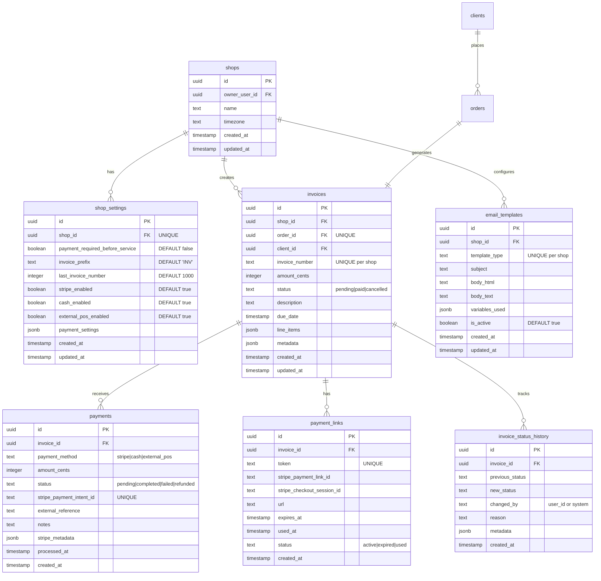

# Invoice Management Database Schema

_Last updated: January 2025_

## Overview

This document defines the complete database schema for Hemsy's Invoice Management feature, including table structures, relationships, indexes, and Row Level Security (RLS) policies for Supabase.

## Table of Contents

1. [Schema Design Principles](#schema-design-principles)
2. [Entity Relationship Diagram](#entity-relationship-diagram)
3. [Tables Definition](#tables-definition)
4. [Indexes Strategy](#indexes-strategy)
5. [Row Level Security Policies](#row-level-security-policies)
6. [Migration Scripts](#migration-scripts)
7. [Data Integrity Constraints](#data-integrity-constraints)
8. [Performance Considerations](#performance-considerations)

## Schema Design Principles

1. **Immutability for Financial Records**: Core invoice data immutable after creation
2. **Audit Trail**: All payment actions tracked with timestamps
3. **Referential Integrity**: Strong foreign key constraints
4. **Efficient Queries**: Optimized for common access patterns
5. **Multi-tenant Isolation**: RLS policies ensure shop data separation

## Entity Relationship Diagram



## Tables Definition

### shop_settings

Extends shop configuration for payment preferences.

```sql
CREATE TABLE shop_settings (
    id UUID PRIMARY KEY DEFAULT gen_random_uuid(),
    shop_id UUID NOT NULL REFERENCES shops(id) ON DELETE CASCADE,

    -- Payment timing preference
    payment_required_before_service BOOLEAN DEFAULT false,

    -- Invoice configuration
    invoice_prefix TEXT DEFAULT 'INV' CHECK (invoice_prefix ~ '^[A-Z0-9-]{1,10}$'),
    last_invoice_number INTEGER DEFAULT 1000 CHECK (last_invoice_number > 0),

    -- Payment method availability
    stripe_enabled BOOLEAN DEFAULT true,
    cash_enabled BOOLEAN DEFAULT true,
    external_pos_enabled BOOLEAN DEFAULT true,

    -- Additional settings as JSON
    payment_settings JSONB DEFAULT '{}',

    -- Timestamps
    created_at TIMESTAMP WITH TIME ZONE DEFAULT now(),
    updated_at TIMESTAMP WITH TIME ZONE DEFAULT now(),

    -- Constraints
    CONSTRAINT unique_shop_settings UNIQUE (shop_id)
);

-- Trigger for updated_at
CREATE TRIGGER update_shop_settings_updated_at
    BEFORE UPDATE ON shop_settings
    FOR EACH ROW
    EXECUTE FUNCTION update_updated_at_column();
```

### invoices

Core invoice table storing all invoice records.

```sql
CREATE TABLE invoices (
    id UUID PRIMARY KEY DEFAULT gen_random_uuid(),
    shop_id UUID NOT NULL REFERENCES shops(id) ON DELETE CASCADE,
    order_id UUID NOT NULL REFERENCES orders(id) ON DELETE RESTRICT,
    client_id UUID NOT NULL REFERENCES clients(id) ON DELETE RESTRICT,

    -- Invoice details
    invoice_number TEXT NOT NULL,
    amount_cents INTEGER NOT NULL CHECK (amount_cents >= 0),
    status TEXT NOT NULL DEFAULT 'pending' CHECK (status IN ('pending', 'paid', 'cancelled')),
    description TEXT,
    due_date TIMESTAMP WITH TIME ZONE,

    -- Structured data
    line_items JSONB NOT NULL DEFAULT '[]',
    metadata JSONB DEFAULT '{}',

    -- Timestamps
    created_at TIMESTAMP WITH TIME ZONE DEFAULT now(),
    updated_at TIMESTAMP WITH TIME ZONE DEFAULT now(),

    -- Constraints
    CONSTRAINT unique_invoice_number_per_shop UNIQUE (shop_id, invoice_number),
    CONSTRAINT unique_order_invoice UNIQUE (order_id),
    CONSTRAINT valid_line_items CHECK (jsonb_typeof(line_items) = 'array')
);

-- Indexes
CREATE INDEX idx_invoices_shop_id ON invoices(shop_id);
CREATE INDEX idx_invoices_status ON invoices(status) WHERE status = 'pending';
CREATE INDEX idx_invoices_client_id ON invoices(client_id);
CREATE INDEX idx_invoices_created_at ON invoices(created_at DESC);

-- Trigger for updated_at
CREATE TRIGGER update_invoices_updated_at
    BEFORE UPDATE ON invoices
    FOR EACH ROW
    EXECUTE FUNCTION update_updated_at_column();
```

### payments

Records all payment transactions for invoices.

```sql
CREATE TABLE payments (
    id UUID PRIMARY KEY DEFAULT gen_random_uuid(),
    invoice_id UUID NOT NULL REFERENCES invoices(id) ON DELETE CASCADE,

    -- Payment details
    payment_method TEXT NOT NULL CHECK (payment_method IN ('stripe', 'cash', 'external_pos')),
    amount_cents INTEGER NOT NULL CHECK (amount_cents > 0),
    status TEXT NOT NULL DEFAULT 'pending' CHECK (status IN ('pending', 'completed', 'failed', 'refunded')),

    -- External references
    stripe_payment_intent_id TEXT UNIQUE,
    external_reference TEXT,
    notes TEXT,

    -- Metadata
    stripe_metadata JSONB,

    -- Timestamps
    processed_at TIMESTAMP WITH TIME ZONE,
    created_at TIMESTAMP WITH TIME ZONE DEFAULT now(),

    -- Constraints
    CONSTRAINT stripe_id_required_for_stripe CHECK (
        (payment_method = 'stripe' AND stripe_payment_intent_id IS NOT NULL) OR
        (payment_method != 'stripe')
    )
);

-- Indexes
CREATE INDEX idx_payments_invoice_id ON payments(invoice_id);
CREATE INDEX idx_payments_stripe_payment_intent_id ON payments(stripe_payment_intent_id) WHERE stripe_payment_intent_id IS NOT NULL;
CREATE INDEX idx_payments_status ON payments(status);
CREATE INDEX idx_payments_created_at ON payments(created_at DESC);
```

### payment_links

Tracks payment links sent to clients.

```sql
CREATE TABLE payment_links (
    id UUID PRIMARY KEY DEFAULT gen_random_uuid(),
    invoice_id UUID NOT NULL REFERENCES invoices(id) ON DELETE CASCADE,

    -- Link details
    token TEXT NOT NULL UNIQUE DEFAULT encode(gen_random_bytes(32), 'hex'),
    stripe_payment_link_id TEXT,
    stripe_checkout_session_id TEXT,
    url TEXT NOT NULL,

    -- Status tracking
    expires_at TIMESTAMP WITH TIME ZONE NOT NULL,
    used_at TIMESTAMP WITH TIME ZONE,
    status TEXT NOT NULL DEFAULT 'active' CHECK (status IN ('active', 'expired', 'used')),

    -- Timestamp
    created_at TIMESTAMP WITH TIME ZONE DEFAULT now(),

    -- Constraints
    CONSTRAINT valid_expiry CHECK (expires_at > created_at)
);

-- Indexes
CREATE INDEX idx_payment_links_token ON payment_links(token);
CREATE INDEX idx_payment_links_invoice_id ON payment_links(invoice_id);
CREATE INDEX idx_payment_links_status ON payment_links(status) WHERE status = 'active';
CREATE INDEX idx_payment_links_expires_at ON payment_links(expires_at) WHERE status = 'active';
```

### invoice_status_history

Audit trail for invoice status changes.

```sql
CREATE TABLE invoice_status_history (
    id UUID PRIMARY KEY DEFAULT gen_random_uuid(),
    invoice_id UUID NOT NULL REFERENCES invoices(id) ON DELETE CASCADE,

    -- Status change details
    previous_status TEXT,
    new_status TEXT NOT NULL,
    changed_by TEXT NOT NULL, -- user_id or 'system'
    reason TEXT,

    -- Additional context
    metadata JSONB DEFAULT '{}',

    -- Timestamp
    created_at TIMESTAMP WITH TIME ZONE DEFAULT now()
);

-- Indexes
CREATE INDEX idx_invoice_status_history_invoice_id ON invoice_status_history(invoice_id);
CREATE INDEX idx_invoice_status_history_created_at ON invoice_status_history(created_at DESC);
```

### email_templates

Customizable email templates for payment communications.

```sql
CREATE TABLE email_templates (
    id UUID PRIMARY KEY DEFAULT gen_random_uuid(),
    shop_id UUID NOT NULL REFERENCES shops(id) ON DELETE CASCADE,

    -- Template details
    template_type TEXT NOT NULL CHECK (template_type IN ('order_created', 'payment_request', 'invoice_receipt')),
    subject TEXT NOT NULL,
    body_html TEXT NOT NULL,
    body_text TEXT NOT NULL,

    -- Template metadata
    variables_used JSONB DEFAULT '[]',
    is_active BOOLEAN DEFAULT true,

    -- Timestamps
    created_at TIMESTAMP WITH TIME ZONE DEFAULT now(),
    updated_at TIMESTAMP WITH TIME ZONE DEFAULT now(),

    -- Constraints
    CONSTRAINT unique_template_type_per_shop UNIQUE (shop_id, template_type)
);

-- Trigger for updated_at
CREATE TRIGGER update_email_templates_updated_at
    BEFORE UPDATE ON email_templates
    FOR EACH ROW
    EXECUTE FUNCTION update_updated_at_column();
```

## Indexes Strategy

### Query Pattern Optimization

```sql
-- Frequent lookups by shop
CREATE INDEX idx_invoices_shop_status ON invoices(shop_id, status);
CREATE INDEX idx_invoices_shop_created ON invoices(shop_id, created_at DESC);

-- Payment reconciliation
CREATE INDEX idx_payments_invoice_status ON payments(invoice_id, status);
CREATE INDEX idx_payments_method_status ON payments(payment_method, status) WHERE status = 'completed';

-- Active payment links
CREATE INDEX idx_payment_links_active ON payment_links(invoice_id, status, expires_at)
WHERE status = 'active' AND expires_at > now();

-- Client payment history
CREATE INDEX idx_invoices_client_status ON invoices(client_id, status, created_at DESC);

-- Financial reporting
CREATE INDEX idx_payments_completed_date ON payments(processed_at)
WHERE status = 'completed';
CREATE INDEX idx_invoices_paid_date ON invoices(updated_at, shop_id)
WHERE status = 'paid';
```

## Row Level Security Policies

### Invoice Access Control

```sql
-- Enable RLS
ALTER TABLE invoices ENABLE ROW LEVEL SECURITY;
ALTER TABLE payments ENABLE ROW LEVEL SECURITY;
ALTER TABLE payment_links ENABLE ROW LEVEL SECURITY;
ALTER TABLE invoice_status_history ENABLE ROW LEVEL SECURITY;
ALTER TABLE shop_settings ENABLE ROW LEVEL SECURITY;
ALTER TABLE email_templates ENABLE ROW LEVEL SECURITY;

-- Invoice policies
CREATE POLICY "Users can view their shop's invoices"
    ON invoices FOR SELECT
    USING (shop_id IN (
        SELECT id FROM shops WHERE owner_user_id = auth.uid()
    ));

CREATE POLICY "Users can create invoices for their shop"
    ON invoices FOR INSERT
    WITH CHECK (shop_id IN (
        SELECT id FROM shops WHERE owner_user_id = auth.uid()
    ));

CREATE POLICY "Users can update their shop's invoices"
    ON invoices FOR UPDATE
    USING (shop_id IN (
        SELECT id FROM shops WHERE owner_user_id = auth.uid()
    ));

-- Payment policies
CREATE POLICY "Users can view payments for their shop's invoices"
    ON payments FOR SELECT
    USING (invoice_id IN (
        SELECT id FROM invoices WHERE shop_id IN (
            SELECT id FROM shops WHERE owner_user_id = auth.uid()
        )
    ));

CREATE POLICY "Users can create payments for their shop's invoices"
    ON payments FOR INSERT
    WITH CHECK (invoice_id IN (
        SELECT id FROM invoices WHERE shop_id IN (
            SELECT id FROM shops WHERE owner_user_id = auth.uid()
        )
    ));

-- Payment link policies
CREATE POLICY "Users can view payment links for their shop"
    ON payment_links FOR SELECT
    USING (invoice_id IN (
        SELECT id FROM invoices WHERE shop_id IN (
            SELECT id FROM shops WHERE owner_user_id = auth.uid()
        )
    ));

CREATE POLICY "Public can view active payment links by token"
    ON payment_links FOR SELECT
    USING (status = 'active' AND expires_at > now());

-- Shop settings policies
CREATE POLICY "Users can view their shop settings"
    ON shop_settings FOR SELECT
    USING (shop_id IN (
        SELECT id FROM shops WHERE owner_user_id = auth.uid()
    ));

CREATE POLICY "Users can update their shop settings"
    ON shop_settings FOR ALL
    USING (shop_id IN (
        SELECT id FROM shops WHERE owner_user_id = auth.uid()
    ));
```

## Migration Scripts

### Initial Migration

```sql
-- Migration: 001_create_invoice_tables.sql
BEGIN;

-- Create updated_at function if not exists
CREATE OR REPLACE FUNCTION update_updated_at_column()
RETURNS TRIGGER AS $$
BEGIN
    NEW.updated_at = now();
    RETURN NEW;
END;
$$ language 'plpgsql';

-- Create all tables
CREATE TABLE shop_settings (...);
CREATE TABLE invoices (...);
CREATE TABLE payments (...);
CREATE TABLE payment_links (...);
CREATE TABLE invoice_status_history (...);
CREATE TABLE email_templates (...);

-- Create indexes
CREATE INDEX ...;

-- Enable RLS
ALTER TABLE ... ENABLE ROW LEVEL SECURITY;

-- Create policies
CREATE POLICY ...;

-- Insert default email templates
INSERT INTO email_templates (shop_id, template_type, subject, body_html, body_text, variables_used)
SELECT
    s.id,
    template.type,
    template.subject,
    template.body_html,
    template.body_text,
    template.variables
FROM shops s
CROSS JOIN (
    VALUES
    ('order_created',
     'Order Confirmation - {{order_number}}',
     '<h2>Order Confirmed</h2><p>Your order {{order_number}} has been received...</p>',
     'Order Confirmed\n\nYour order {{order_number}} has been received...',
     '["order_number", "client_name", "order_total", "expected_completion"]'::jsonb),
    ('payment_request',
     'Payment Request - Invoice {{invoice_number}}',
     '<h2>Payment Request</h2><p>Your invoice {{invoice_number}} is ready...</p>',
     'Payment Request\n\nYour invoice {{invoice_number}} is ready...',
     '["invoice_number", "amount", "due_date", "payment_link"]'::jsonb),
    ('invoice_receipt',
     'Payment Receipt - Invoice {{invoice_number}}',
     '<h2>Payment Received</h2><p>Thank you for your payment...</p>',
     'Payment Received\n\nThank you for your payment...',
     '["invoice_number", "amount", "payment_date", "payment_method"]'::jsonb)
) AS template(type, subject, body_html, body_text, variables);

COMMIT;
```

### Rollback Script

```sql
-- Rollback: 001_create_invoice_tables_rollback.sql
BEGIN;

-- Drop policies
DROP POLICY IF EXISTS "Users can view their shop's invoices" ON invoices;
DROP POLICY IF EXISTS "Users can create invoices for their shop" ON invoices;
-- ... (all other policies)

-- Drop indexes
DROP INDEX IF EXISTS idx_invoices_shop_id;
-- ... (all other indexes)

-- Drop tables in reverse dependency order
DROP TABLE IF EXISTS invoice_status_history CASCADE;
DROP TABLE IF EXISTS payment_links CASCADE;
DROP TABLE IF EXISTS payments CASCADE;
DROP TABLE IF EXISTS invoices CASCADE;
DROP TABLE IF EXISTS email_templates CASCADE;
DROP TABLE IF EXISTS shop_settings CASCADE;

COMMIT;
```

## Data Integrity Constraints

### Business Rules Enforcement

```sql
-- Ensure only one unpaid invoice per order
CREATE OR REPLACE FUNCTION check_single_unpaid_invoice()
RETURNS TRIGGER AS $$
BEGIN
    IF EXISTS (
        SELECT 1 FROM invoices
        WHERE order_id = NEW.order_id
        AND status = 'pending'
        AND id != COALESCE(NEW.id, gen_random_uuid())
    ) THEN
        RAISE EXCEPTION 'Order already has an unpaid invoice';
    END IF;
    RETURN NEW;
END;
$$ LANGUAGE plpgsql;

CREATE TRIGGER enforce_single_unpaid_invoice
    BEFORE INSERT OR UPDATE ON invoices
    FOR EACH ROW
    EXECUTE FUNCTION check_single_unpaid_invoice();

-- Prevent invoice modification after payment
CREATE OR REPLACE FUNCTION prevent_paid_invoice_changes()
RETURNS TRIGGER AS $$
BEGIN
    IF OLD.status = 'paid' AND NEW.amount_cents != OLD.amount_cents THEN
        RAISE EXCEPTION 'Cannot modify amount of paid invoice';
    END IF;
    RETURN NEW;
END;
$$ LANGUAGE plpgsql;

CREATE TRIGGER protect_paid_invoices
    BEFORE UPDATE ON invoices
    FOR EACH ROW
    EXECUTE FUNCTION prevent_paid_invoice_changes();

-- Auto-expire payment links
CREATE OR REPLACE FUNCTION expire_payment_links()
RETURNS void AS $$
BEGIN
    UPDATE payment_links
    SET status = 'expired'
    WHERE status = 'active'
    AND expires_at < now();
END;
$$ LANGUAGE plpgsql;

-- Schedule periodic expiration (via cron job or application)
```

## Performance Considerations

### Query Optimization

```sql
-- Materialized view for payment analytics
CREATE MATERIALIZED VIEW shop_payment_analytics AS
SELECT
    s.id as shop_id,
    DATE_TRUNC('month', p.processed_at) as month,
    p.payment_method,
    COUNT(*) as payment_count,
    SUM(p.amount_cents) as total_amount_cents,
    AVG(p.amount_cents) as avg_amount_cents
FROM shops s
JOIN invoices i ON i.shop_id = s.id
JOIN payments p ON p.invoice_id = i.id
WHERE p.status = 'completed'
GROUP BY s.id, DATE_TRUNC('month', p.processed_at), p.payment_method;

-- Refresh strategy
CREATE INDEX idx_shop_payment_analytics_shop_month
ON shop_payment_analytics(shop_id, month DESC);

-- Partial indexes for common queries
CREATE INDEX idx_invoices_pending_recent
ON invoices(shop_id, created_at DESC)
WHERE status = 'pending' AND created_at > (now() - INTERVAL '30 days');

-- Function-based index for invoice search
CREATE INDEX idx_invoices_search
ON invoices USING gin(
    to_tsvector('english',
        invoice_number || ' ' ||
        COALESCE(description, '') || ' ' ||
        COALESCE(metadata::text, '')
    )
);
```

### Partitioning Strategy (Future)

```sql
-- For high-volume shops, partition by created_at
CREATE TABLE invoices_partitioned (
    LIKE invoices INCLUDING ALL
) PARTITION BY RANGE (created_at);

-- Monthly partitions
CREATE TABLE invoices_2025_01 PARTITION OF invoices_partitioned
    FOR VALUES FROM ('2025-01-01') TO ('2025-02-01');
```

## TypeScript Type Generation

```typescript
// Generated types from Supabase
export interface Database {
  public: {
    Tables: {
      shop_settings: {
        Row: {
          id: string;
          shop_id: string;
          payment_required_before_service: boolean;
          invoice_prefix: string;
          last_invoice_number: number;
          stripe_enabled: boolean;
          cash_enabled: boolean;
          external_pos_enabled: boolean;
          payment_settings: Json;
          created_at: string;
          updated_at: string;
        };
        Insert: Omit<ShopSettingsRow, 'id' | 'created_at' | 'updated_at'>;
        Update: Partial<ShopSettingsInsert>;
      };
      invoices: {
        Row: {
          id: string;
          shop_id: string;
          order_id: string;
          client_id: string;
          invoice_number: string;
          amount_cents: number;
          status: 'pending' | 'paid' | 'cancelled';
          description: string | null;
          due_date: string | null;
          line_items: Json;
          metadata: Json;
          created_at: string;
          updated_at: string;
        };
        Insert: Omit<InvoiceRow, 'id' | 'created_at' | 'updated_at'>;
        Update: Partial<InvoiceInsert>;
      };
      // ... other tables
    };
  };
}
```

## Conclusion

This database schema provides a robust foundation for Hemsy's invoice management feature with:

- Strong data integrity through constraints and triggers
- Optimized query performance through strategic indexing
- Secure multi-tenant isolation via RLS policies
- Comprehensive audit trail for compliance
- Flexibility for future enhancements through JSONB fields

The schema balances normalization with practical performance considerations, ensuring both data consistency and query efficiency.
