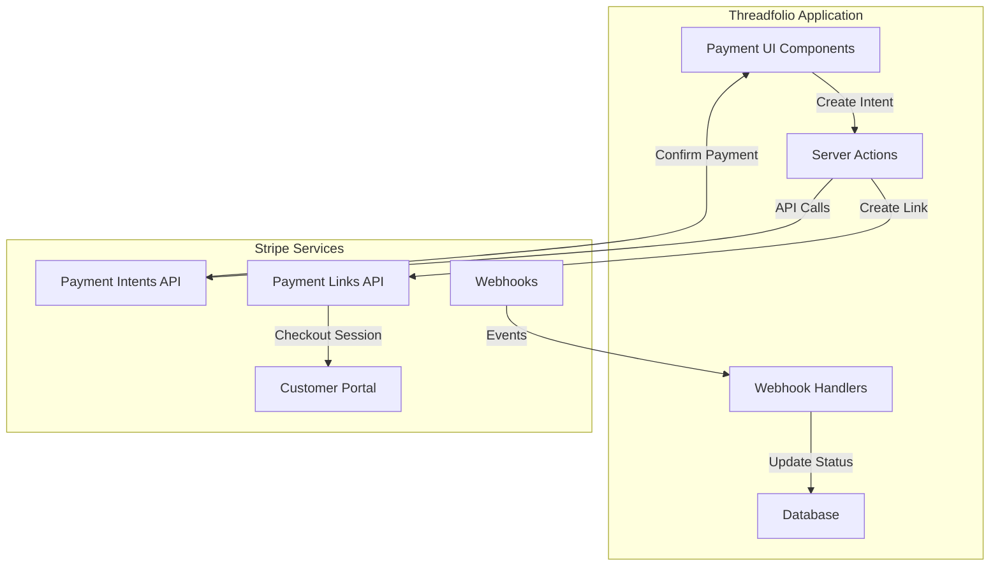

# Stripe Integration Architecture

_Last updated: January 2025_

## Overview

This document details the comprehensive Stripe integration approach for Threadfolio's Invoice Management feature, covering payment processing, webhook handling, security implementation, and error management strategies.

## Table of Contents

1. [Integration Overview](#integration-overview)
2. [Stripe SDK Setup](#stripe-sdk-setup)
3. [Payment Methods Architecture](#payment-methods-architecture)
4. [Webhook Implementation](#webhook-implementation)
5. [Security Implementation](#security-implementation)
6. [Error Handling Strategy](#error-handling-strategy)
7. [Testing Strategy](#testing-strategy)
8. [Monitoring and Observability](#monitoring-and-observability)

## Integration Overview

### Core Integration Points



### Integration Architecture Principles

1. **Server-Side First**: All Stripe API calls from Server Actions
2. **Idempotency**: All payment operations are idempotent
3. **Webhook Resilience**: Handle out-of-order and duplicate events
4. **Progressive Enhancement**: Fallback for JavaScript-disabled clients
5. **PCI Compliance**: Never touch raw card data

## Stripe SDK Setup

### Environment Configuration

```typescript
// lib/services/stripe/config.ts
export const stripeConfig = {
  apiVersion: '2023-10-16' as const,
  maxNetworkRetries: 3,
  timeout: 30000, // 30 seconds
  telemetry: process.env.NODE_ENV === 'production',
} as const;

// Development vs Production keys
export const getStripeKey = () => {
  if (process.env.NODE_ENV === 'production') {
    return {
      publishable: process.env.STRIPE_PUBLISHABLE_KEY!,
      secret: process.env.STRIPE_SECRET_KEY!,
      webhook: process.env.STRIPE_WEBHOOK_SECRET!,
    };
  }
  return {
    publishable: process.env.STRIPE_TEST_PUBLISHABLE_KEY!,
    secret: process.env.STRIPE_TEST_SECRET_KEY!,
    webhook: process.env.STRIPE_TEST_WEBHOOK_SECRET!,
  };
};
```

### Stripe Client Initialization

```typescript
// lib/services/stripe/client.ts
import Stripe from 'stripe';
import { stripeConfig, getStripeKey } from './config';

// Server-side Stripe client
let stripeClient: Stripe | null = null;

export const getStripeClient = (): Stripe => {
  if (!stripeClient) {
    const { secret } = getStripeKey();
    stripeClient = new Stripe(secret, stripeConfig);
  }
  return stripeClient;
};

// Client-side Stripe instance
export const getStripePromise = async () => {
  const { publishable } = getStripeKey();
  const { loadStripe } = await import('@stripe/stripe-js');
  return loadStripe(publishable);
};
```

### Type-Safe Stripe Integration

```typescript
// types/stripe.ts
import type { Stripe } from 'stripe';

export interface StripeMetadata {
  invoice_id: string;
  order_id: string;
  shop_id: string;
  client_id: string;
}

export interface PaymentIntentCreateParams
  extends Stripe.PaymentIntentCreateParams {
  metadata: StripeMetadata;
}

export interface PaymentLinkCreateParams
  extends Stripe.PaymentLinkCreateParams {
  metadata: Pick<StripeMetadata, 'invoice_id'>;
}

// Type guards
export const isStripeError = (error: unknown): error is Stripe.StripeError => {
  return (
    typeof error === 'object' &&
    error !== null &&
    'type' in error &&
    'message' in error
  );
};
```

## Payment Methods Architecture

### Payment Intent Flow (In-App Payments)

```typescript
// lib/services/stripe/payment-intents.ts
import { getStripeClient } from './client';
import type { Invoice } from '@/types';
import { StripeMetadata, PaymentIntentCreateParams } from '@/types/stripe';

export class PaymentIntentService {
  private stripe = getStripeClient();

  async createPaymentIntent(invoice: Invoice): Promise<Stripe.PaymentIntent> {
    const params: PaymentIntentCreateParams = {
      amount: invoice.amount_cents,
      currency: 'usd',
      automatic_payment_methods: {
        enabled: true,
        allow_redirects: 'never', // Mobile-friendly
      },
      metadata: {
        invoice_id: invoice.id,
        order_id: invoice.order_id,
        shop_id: invoice.shop_id,
        client_id: invoice.client_id,
      },
      description: `Invoice ${invoice.invoice_number}`,
      statement_descriptor_suffix: invoice.invoice_number.slice(-22), // Max 22 chars
      receipt_email: invoice.client_email,
    };

    // Idempotency key based on invoice
    const idempotencyKey = `pi_${invoice.id}_${invoice.version}`;

    return await this.stripe.paymentIntents.create(params, {
      idempotencyKey,
    });
  }

  async confirmPayment(
    paymentIntentId: string,
    paymentMethodId: string
  ): Promise<Stripe.PaymentIntent> {
    return await this.stripe.paymentIntents.confirm(paymentIntentId, {
      payment_method: paymentMethodId,
      return_url: `${process.env.NEXT_PUBLIC_APP_URL}/payments/confirm`,
    });
  }

  async cancelPaymentIntent(
    paymentIntentId: string
  ): Promise<Stripe.PaymentIntent> {
    return await this.stripe.paymentIntents.cancel(paymentIntentId, {
      cancellation_reason: 'abandoned',
    });
  }
}
```

### Payment Links Flow (Remote Payments)

```typescript
// lib/services/stripe/payment-links.ts
export class PaymentLinkService {
  private stripe = getStripeClient();

  async createPaymentLink(invoice: Invoice): Promise<{
    paymentLink: Stripe.PaymentLink;
    checkoutUrl: string;
  }> {
    // Create product dynamically for invoice
    const product = await this.stripe.products.create({
      name: `Invoice ${invoice.invoice_number}`,
      description:
        invoice.description || `Services for order ${invoice.order_id}`,
      metadata: {
        invoice_id: invoice.id,
      },
    });

    // Create price for the product
    const price = await this.stripe.prices.create({
      product: product.id,
      unit_amount: invoice.amount_cents,
      currency: 'usd',
    });

    // Create payment link
    const paymentLink = await this.stripe.paymentLinks.create({
      line_items: [
        {
          price: price.id,
          quantity: 1,
        },
      ],
      metadata: {
        invoice_id: invoice.id,
      },
      after_completion: {
        type: 'redirect',
        redirect: {
          url: `${process.env.NEXT_PUBLIC_APP_URL}/pay/success?invoice_id=${invoice.id}`,
        },
      },
      allow_promotion_codes: false,
      invoice_creation: {
        enabled: false, // We manage our own invoices
      },
      phone_number_collection: {
        enabled: false,
      },
      custom_text: {
        submit: {
          message: `Pay ${formatCurrency(invoice.amount_cents)}`,
        },
      },
    });

    // Generate secure checkout URL with session
    const checkoutSession = await this.stripe.checkout.sessions.create({
      payment_link: paymentLink.id,
      client_reference_id: invoice.id,
      expires_at: Math.floor(Date.now() / 1000) + 24 * 60 * 60, // 24 hours
    });

    return {
      paymentLink,
      checkoutUrl: checkoutSession.url!,
    };
  }

  async expirePaymentLink(paymentLinkId: string): Promise<void> {
    await this.stripe.paymentLinks.update(paymentLinkId, {
      active: false,
    });
  }
}
```

### Stripe Elements Integration

```typescript
// components/payments/StripeElementsForm.tsx
'use client';

import { Elements, PaymentElement, useStripe, useElements } from '@stripe/react-stripe-js';
import { useState } from 'react';
import type { StripeElementsOptions } from '@stripe/stripe-js';

interface StripePaymentFormProps {
  clientSecret: string;
  onSuccess: () => void;
  onError: (error: Error) => void;
}

const PaymentForm: React.FC<StripePaymentFormProps> = ({
  clientSecret,
  onSuccess,
  onError,
}) => {
  const stripe = useStripe();
  const elements = useElements();
  const [isProcessing, setIsProcessing] = useState(false);

  const handleSubmit = async (e: React.FormEvent) => {
    e.preventDefault();

    if (!stripe || !elements) return;

    setIsProcessing(true);

    try {
      const { error, paymentIntent } = await stripe.confirmPayment({
        elements,
        confirmParams: {
          return_url: `${window.location.origin}/payments/confirm`,
        },
        redirect: 'if_required', // Handle 3DS in modal
      });

      if (error) {
        onError(new Error(error.message));
      } else if (paymentIntent?.status === 'succeeded') {
        onSuccess();
      }
    } catch (err) {
      onError(err as Error);
    } finally {
      setIsProcessing(false);
    }
  };

  return (
    <form onSubmit={handleSubmit}>
      <PaymentElement
        options={{
          layout: 'tabs',
          defaultValues: {
            billingDetails: {
              email: 'prefilled@email.com',
            },
          },
        }}
      />
      <Button
        type="submit"
        disabled={!stripe || isProcessing}
        fullWidth
        sx={{ mt: 2 }}
      >
        {isProcessing ? 'Processing...' : 'Pay Now'}
      </Button>
    </form>
  );
};

export const StripeElementsForm: React.FC<StripePaymentFormProps> = (props) => {
  const options: StripeElementsOptions = {
    clientSecret: props.clientSecret,
    appearance: {
      theme: 'stripe',
      variables: {
        colorPrimary: '#0570de',
        colorBackground: '#ffffff',
        colorText: '#30313d',
        colorDanger: '#df1b41',
        fontFamily: 'Roboto, system-ui, sans-serif',
        spacingUnit: '4px',
        borderRadius: '4px',
      },
    },
  };

  return (
    <Elements stripe={stripePromise} options={options}>
      <PaymentForm {...props} />
    </Elements>
  );
};
```

## Webhook Implementation

### Webhook Handler Architecture

```typescript
// app/api/webhooks/stripe/route.ts
import { NextRequest, NextResponse } from 'next/server';
import { getStripeClient } from '@/lib/services/stripe/client';
import { WebhookEventProcessor } from '@/lib/services/stripe/webhook-processor';

export async function POST(request: NextRequest) {
  const body = await request.text();
  const signature = request.headers.get('stripe-signature');

  if (!signature) {
    return NextResponse.json(
      { error: 'Missing stripe-signature header' },
      { status: 400 }
    );
  }

  const stripe = getStripeClient();
  const processor = new WebhookEventProcessor();

  try {
    // Verify webhook signature
    const event = stripe.webhooks.constructEvent(
      body,
      signature,
      process.env.STRIPE_WEBHOOK_SECRET!
    );

    // Process event
    await processor.processEvent(event);

    return NextResponse.json({ received: true });
  } catch (err) {
    console.error('Webhook error:', err);

    // Return 200 to prevent Stripe retries for permanent failures
    if (err instanceof Stripe.errors.StripeSignatureVerificationError) {
      return NextResponse.json({ error: 'Invalid signature' }, { status: 400 });
    }

    return NextResponse.json({ received: true });
  }
}
```

### Webhook Event Processor

```typescript
// lib/services/stripe/webhook-processor.ts
import type { Stripe } from 'stripe';
import { createClient } from '@/lib/supabase/server';

export class WebhookEventProcessor {
  private readonly eventHandlers: Map<
    string,
    (event: Stripe.Event) => Promise<void>
  >;

  constructor() {
    this.eventHandlers = new Map([
      [
        'payment_intent.succeeded',
        this.handlePaymentIntentSucceeded.bind(this),
      ],
      [
        'payment_intent.payment_failed',
        this.handlePaymentIntentFailed.bind(this),
      ],
      [
        'checkout.session.completed',
        this.handleCheckoutSessionCompleted.bind(this),
      ],
      ['payment_intent.canceled', this.handlePaymentIntentCanceled.bind(this)],
    ]);
  }

  async processEvent(event: Stripe.Event): Promise<void> {
    // Idempotency check
    const isProcessed = await this.checkEventProcessed(event.id);
    if (isProcessed) {
      console.log(`Event ${event.id} already processed, skipping`);
      return;
    }

    const handler = this.eventHandlers.get(event.type);
    if (!handler) {
      console.log(`No handler for event type: ${event.type}`);
      return;
    }

    try {
      await handler(event);
      await this.markEventProcessed(event.id);
    } catch (error) {
      console.error(`Error processing ${event.type}:`, error);
      throw error; // Let Stripe retry
    }
  }

  private async handlePaymentIntentSucceeded(event: Stripe.Event) {
    const paymentIntent = event.data.object as Stripe.PaymentIntent;
    const invoiceId = paymentIntent.metadata.invoice_id;

    if (!invoiceId) {
      console.error('No invoice_id in payment intent metadata');
      return;
    }

    const supabase = createClient();

    // Start transaction
    const { error } = await supabase.rpc('process_successful_payment', {
      p_invoice_id: invoiceId,
      p_payment_intent_id: paymentIntent.id,
      p_amount_cents: paymentIntent.amount,
      p_payment_method: 'stripe',
      p_stripe_metadata: paymentIntent,
    });

    if (error) {
      throw new Error(`Failed to process payment: ${error.message}`);
    }

    // Send receipt email
    await this.sendReceiptEmail(invoiceId);
  }

  private async handlePaymentIntentFailed(event: Stripe.Event) {
    const paymentIntent = event.data.object as Stripe.PaymentIntent;
    const invoiceId = paymentIntent.metadata.invoice_id;

    // Log failure for monitoring
    console.error('Payment failed:', {
      invoice_id: invoiceId,
      error: paymentIntent.last_payment_error,
    });

    // Update payment record
    const supabase = createClient();
    await supabase
      .from('payments')
      .update({
        status: 'failed',
        stripe_metadata: paymentIntent.last_payment_error,
      })
      .eq('stripe_payment_intent_id', paymentIntent.id);
  }

  private async handleCheckoutSessionCompleted(event: Stripe.Event) {
    const session = event.data.object as Stripe.Checkout.Session;
    const invoiceId = session.client_reference_id;

    if (!invoiceId || session.payment_status !== 'paid') {
      return;
    }

    // Process similar to payment intent succeeded
    await this.processSuccessfulPayment(invoiceId, session);
  }

  private async checkEventProcessed(eventId: string): Promise<boolean> {
    const supabase = createClient();
    const { data } = await supabase
      .from('stripe_webhook_events')
      .select('id')
      .eq('event_id', eventId)
      .single();

    return !!data;
  }

  private async markEventProcessed(eventId: string): Promise<void> {
    const supabase = createClient();
    await supabase.from('stripe_webhook_events').insert({ event_id: eventId });
  }
}
```

### Webhook Event Logging

```sql
-- Table for webhook event tracking
CREATE TABLE stripe_webhook_events (
    id UUID PRIMARY KEY DEFAULT gen_random_uuid(),
    event_id TEXT NOT NULL UNIQUE,
    event_type TEXT NOT NULL,
    processed_at TIMESTAMP WITH TIME ZONE DEFAULT now(),

    -- Index for quick lookups
    INDEX idx_stripe_webhook_events_event_id (event_id)
);

-- Cleanup old events (via cron)
DELETE FROM stripe_webhook_events
WHERE processed_at < now() - INTERVAL '30 days';
```

## Security Implementation

### PCI Compliance Strategy

```typescript
// lib/services/stripe/security.ts
export class StripeSecurityService {
  // Never log sensitive data
  static sanitizeForLogging(data: any): any {
    const sensitive = ['card', 'cvc', 'number', 'exp_month', 'exp_year'];

    if (typeof data !== 'object' || data === null) {
      return data;
    }

    const sanitized = { ...data };

    for (const key of Object.keys(sanitized)) {
      if (sensitive.some((s) => key.toLowerCase().includes(s))) {
        sanitized[key] = '[REDACTED]';
      } else if (typeof sanitized[key] === 'object') {
        sanitized[key] = this.sanitizeForLogging(sanitized[key]);
      }
    }

    return sanitized;
  }

  // Validate webhook signatures
  static async validateWebhookSignature(
    payload: string,
    signature: string,
    secret: string
  ): Promise<boolean> {
    const stripe = getStripeClient();

    try {
      stripe.webhooks.constructEvent(payload, signature, secret);
      return true;
    } catch (err) {
      return false;
    }
  }

  // Generate secure tokens for payment links
  static generateSecureToken(): string {
    return crypto.randomBytes(32).toString('hex');
  }

  // Validate payment amounts
  static validateAmount(cents: number): boolean {
    return (
      Number.isInteger(cents) && cents > 0 && cents <= 99999999 // Max $999,999.99
    );
  }
}
```

### Content Security Policy

```typescript
// middleware.ts (partial)
export function middleware(request: NextRequest) {
  const response = NextResponse.next();

  // Add CSP headers for payment pages
  if (request.nextUrl.pathname.startsWith('/pay/')) {
    response.headers.set(
      'Content-Security-Policy',
      "default-src 'self'; " +
        "script-src 'self' https://js.stripe.com 'unsafe-inline'; " +
        "frame-src 'self' https://js.stripe.com https://hooks.stripe.com; " +
        "style-src 'self' 'unsafe-inline'; " +
        "img-src 'self' https://*.stripe.com data:; " +
        "connect-src 'self' https://api.stripe.com;"
    );
  }

  return response;
}
```

### Rate Limiting

```typescript
// lib/services/stripe/rate-limiter.ts
import { LRUCache } from 'lru-cache';

export class PaymentRateLimiter {
  private cache: LRUCache<string, number>;

  constructor() {
    this.cache = new LRUCache<string, number>({
      max: 10000,
      ttl: 15 * 60 * 1000, // 15 minutes
    });
  }

  async checkLimit(
    identifier: string,
    maxAttempts: number = 5
  ): Promise<boolean> {
    const attempts = this.cache.get(identifier) || 0;

    if (attempts >= maxAttempts) {
      return false;
    }

    this.cache.set(identifier, attempts + 1);
    return true;
  }

  reset(identifier: string): void {
    this.cache.delete(identifier);
  }
}

// Usage in Server Action
export async function processPayment(invoiceId: string) {
  const rateLimiter = new PaymentRateLimiter();
  const session = await getSession();

  if (!(await rateLimiter.checkLimit(`payment:${session.userId}`))) {
    throw new Error('Too many payment attempts. Please try again later.');
  }

  // Process payment...
}
```

## Error Handling Strategy

### Stripe Error Handling

```typescript
// lib/services/stripe/error-handler.ts
export class StripeErrorHandler {
  static handleError(error: unknown): {
    message: string;
    code: string;
    retryable: boolean;
  } {
    if (!isStripeError(error)) {
      return {
        message: 'An unexpected error occurred',
        code: 'unknown_error',
        retryable: false,
      };
    }

    const errorMap: Record<string, { message: string; retryable: boolean }> = {
      card_declined: {
        message:
          'Your card was declined. Please try a different payment method.',
        retryable: false,
      },
      insufficient_funds: {
        message: 'Your card has insufficient funds.',
        retryable: false,
      },
      payment_intent_authentication_failure: {
        message: 'Authentication failed. Please try again.',
        retryable: true,
      },
      rate_limit: {
        message: 'Too many requests. Please try again later.',
        retryable: true,
      },
      api_connection_error: {
        message: 'Connection error. Please check your internet and try again.',
        retryable: true,
      },
    };

    const errorInfo = errorMap[error.code || ''] || {
      message: error.message || 'Payment processing failed',
      retryable: error.type === 'api_error',
    };

    return {
      message: errorInfo.message,
      code: error.code || 'stripe_error',
      retryable: errorInfo.retryable,
    };
  }

  static async withRetry<T>(
    operation: () => Promise<T>,
    maxRetries: number = 3
  ): Promise<T> {
    let lastError: Error | null = null;

    for (let i = 0; i < maxRetries; i++) {
      try {
        return await operation();
      } catch (error) {
        lastError = error as Error;

        const { retryable } = this.handleError(error);
        if (!retryable || i === maxRetries - 1) {
          throw error;
        }

        // Exponential backoff
        await new Promise((resolve) =>
          setTimeout(resolve, Math.pow(2, i) * 1000)
        );
      }
    }

    throw lastError!;
  }
}
```

### User-Friendly Error Messages

```typescript
// components/payments/PaymentErrorAlert.tsx
interface PaymentErrorAlertProps {
  error: Error;
  onRetry?: () => void;
}

export const PaymentErrorAlert: React.FC<PaymentErrorAlertProps> = ({
  error,
  onRetry,
}) => {
  const { message, code, retryable } = StripeErrorHandler.handleError(error);

  return (
    <Alert
      severity="error"
      action={
        retryable && onRetry && (
          <Button color="inherit" size="small" onClick={onRetry}>
            Try Again
          </Button>
        )
      }
    >
      <AlertTitle>Payment Error</AlertTitle>
      {message}
      {code === 'card_declined' && (
        <Box mt={1}>
          <Typography variant="body2">
            You can try a different card or contact your bank for more information.
          </Typography>
        </Box>
      )}
    </Alert>
  );
};
```

## Testing Strategy

### Test Environment Setup

```typescript
// tests/stripe/setup.ts
import { config } from 'dotenv';
config({ path: '.env.test' });

export const stripeTestConfig = {
  // Test cards
  cards: {
    success: '4242424242424242',
    declined: '4000000000000002',
    requires3DS: '4000002500003155',
    insufficientFunds: '4000000000009995',
  },

  // Test amounts
  amounts: {
    small: 100, // $1.00
    medium: 5000, // $50.00
    large: 100000, // $1,000.00
  },
};

// Mock Stripe client for unit tests
export const createMockStripeClient = () => {
  return {
    paymentIntents: {
      create: jest.fn().mockResolvedValue({
        id: 'pi_test_123',
        client_secret: 'pi_test_123_secret',
        status: 'requires_payment_method',
      }),
      confirm: jest.fn().mockResolvedValue({
        id: 'pi_test_123',
        status: 'succeeded',
      }),
    },
    webhooks: {
      constructEvent: jest.fn().mockReturnValue({
        id: 'evt_test_123',
        type: 'payment_intent.succeeded',
        data: { object: { id: 'pi_test_123' } },
      }),
    },
  };
};
```

### Integration Tests

```typescript
// tests/stripe/payment-flow.test.ts
describe('Stripe Payment Flow', () => {
  it('should process payment successfully', async () => {
    const invoice = await createTestInvoice();
    const service = new PaymentIntentService();

    // Create payment intent
    const intent = await service.createPaymentIntent(invoice);
    expect(intent.amount).toBe(invoice.amount_cents);
    expect(intent.metadata.invoice_id).toBe(invoice.id);

    // Simulate payment confirmation
    const confirmed = await service.confirmPayment(intent.id, 'pm_card_visa');
    expect(confirmed.status).toBe('succeeded');
  });

  it('should handle 3DS authentication', async () => {
    const invoice = await createTestInvoice();
    const service = new PaymentIntentService();

    const intent = await service.createPaymentIntent(invoice);

    // Simulate 3DS required
    const response = await service.confirmPayment(
      intent.id,
      'pm_card_threeDSecureRequired'
    );

    expect(response.status).toBe('requires_action');
    expect(response.next_action?.type).toBe('use_stripe_sdk');
  });
});
```

### Webhook Testing

```typescript
// tests/stripe/webhook.test.ts
describe('Stripe Webhook Handler', () => {
  it('should process payment success webhook', async () => {
    const payload = JSON.stringify({
      id: 'evt_test_123',
      type: 'payment_intent.succeeded',
      data: {
        object: {
          id: 'pi_test_123',
          amount: 5000,
          metadata: {
            invoice_id: 'inv_123',
          },
        },
      },
    });

    const signature = stripe.webhooks.generateTestHeaderString({
      payload,
      secret: process.env.STRIPE_TEST_WEBHOOK_SECRET!,
    });

    const response = await fetch('/api/webhooks/stripe', {
      method: 'POST',
      headers: {
        'stripe-signature': signature,
      },
      body: payload,
    });

    expect(response.status).toBe(200);

    // Verify invoice updated
    const invoice = await getInvoice('inv_123');
    expect(invoice.status).toBe('paid');
  });
});
```

## Monitoring and Observability

### Stripe Dashboard Integration

```typescript
// lib/services/stripe/monitoring.ts
export class StripeMonitoring {
  static trackPaymentMetrics(event: string, data: any) {
    // Send to analytics
    analytics.track(event, {
      ...data,
      stripe_account: process.env.STRIPE_ACCOUNT_ID,
      environment: process.env.NODE_ENV,
    });

    // Log for debugging
    console.log(
      '[Stripe Metrics]',
      event,
      StripeSecurityService.sanitizeForLogging(data)
    );
  }

  static createPaymentDashboard() {
    return {
      totalRevenue: async (shopId: string, period: string) => {
        const supabase = createClient();
        const { data } = await supabase
          .from('payments')
          .select('amount_cents')
          .eq('shop_id', shopId)
          .eq('status', 'completed')
          .gte('processed_at', getStartOfPeriod(period));

        return data?.reduce((sum, p) => sum + p.amount_cents, 0) || 0;
      },

      paymentMethodDistribution: async (shopId: string) => {
        const supabase = createClient();
        const { data } = await supabase
          .from('payments')
          .select('payment_method, count')
          .eq('shop_id', shopId)
          .eq('status', 'completed');

        return data?.reduce(
          (acc, p) => {
            acc[p.payment_method] = (acc[p.payment_method] || 0) + 1;
            return acc;
          },
          {} as Record<string, number>
        );
      },

      failureRate: async (shopId: string, period: string) => {
        // Calculate payment failure rate
        const { data: payments } = await supabase
          .from('payments')
          .select('status')
          .eq('shop_id', shopId)
          .gte('created_at', getStartOfPeriod(period));

        const total = payments?.length || 0;
        const failed =
          payments?.filter((p) => p.status === 'failed').length || 0;

        return total > 0 ? (failed / total) * 100 : 0;
      },
    };
  }
}
```

### Error Tracking

```typescript
// lib/services/stripe/error-tracking.ts
export class StripeErrorTracking {
  static async logError(error: Error, context: any) {
    const errorData = {
      message: error.message,
      stack: error.stack,
      context: StripeSecurityService.sanitizeForLogging(context),
      timestamp: new Date().toISOString(),
    };

    // Log to error tracking service (Sentry, etc.)
    if (process.env.NODE_ENV === 'production') {
      await errorTracker.captureException(error, {
        extra: errorData,
        tags: {
          feature: 'stripe_payments',
        },
      });
    }

    // Log to Supabase for analysis
    const supabase = createClient();
    await supabase.from('payment_errors').insert({
      error_type: error.name,
      error_message: error.message,
      error_context: errorData,
    });
  }
}
```

## Conclusion

This Stripe integration architecture provides a secure, reliable, and scalable payment processing system for Threadfolio. Key strengths include:

- **Security First**: PCI compliance through Stripe Elements and secure token handling
- **Reliability**: Comprehensive error handling and webhook resilience
- **Performance**: Optimized for mobile-first experience
- **Observability**: Built-in monitoring and error tracking
- **Testability**: Comprehensive test coverage strategy

The architecture supports both immediate and deferred payment models while maintaining flexibility for future payment method additions.
