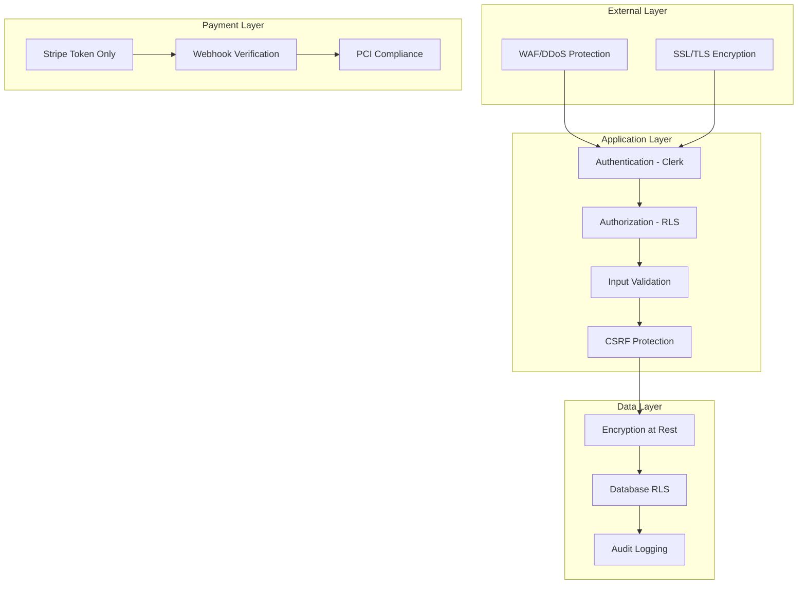

# Security and PCI Compliance Architecture

_Last updated: January 2025_

## Overview

This document outlines the comprehensive security architecture and PCI compliance strategy for Threadfolio's Invoice Management feature, ensuring secure payment processing while maintaining the trust of seamstresses and their clients.

## Table of Contents

1. [Security Architecture Overview](#security-architecture-overview)
2. [PCI Compliance Strategy](#pci-compliance-strategy)
3. [Authentication & Authorization](#authentication--authorization)
4. [Data Security](#data-security)
5. [Network Security](#network-security)
6. [Application Security](#application-security)
7. [Operational Security](#operational-security)
8. [Compliance Monitoring](#compliance-monitoring)

## Security Architecture Overview

### Defense in Depth Model



### Security Principles

1. **Least Privilege**: Users access only their shop's data
2. **Zero Trust**: Verify every request regardless of source
3. **Defense in Depth**: Multiple security layers
4. **Secure by Default**: Security enabled without configuration
5. **Fail Secure**: Errors default to denying access

## PCI Compliance Strategy

### Compliance Scope Reduction

```typescript
// PCI DSS Scope Minimization Strategy

/**
 * SAQ A Eligibility (Minimal Scope):
 * 1. Card data handled entirely by Stripe
 * 2. No card data touches our servers
 * 3. Stripe Elements iframe isolation
 * 4. Tokenization for all references
 */

// ❌ NEVER DO THIS - Violates PCI Compliance
interface BadPaymentData {
  cardNumber: string; // NEVER store
  cvv: string; // NEVER store
  expiryDate: string; // NEVER store
}

// ✅ CORRECT - PCI Compliant
interface SecurePaymentData {
  stripePaymentMethodId: string; // Token only
  last4: string; // Safe to store
  brand: string; // Safe to store
  expiryMonth: number; // Safe to store
  expiryYear: number; // Safe to store
}
```

### Stripe Elements Integration

```typescript
// components/payments/SecurePaymentForm.tsx
'use client';

import { loadStripe } from '@stripe/stripe-js';
import {
  Elements,
  CardElement,
  useStripe,
  useElements,
} from '@stripe/react-stripe-js';

// Security Configuration
const CARD_ELEMENT_OPTIONS = {
  style: {
    base: {
      fontSize: '16px',
      color: '#424770',
      '::placeholder': {
        color: '#aab7c4',
      },
    },
  },
  hidePostalCode: false, // Required for fraud prevention
  disabled: false,
  // Strict CSP-compliant styling only
};

export const SecurePaymentForm: React.FC<PaymentFormProps> = ({
  clientSecret,
  onSuccess,
  onError,
}) => {
  const stripe = useStripe();
  const elements = useElements();

  const handleSubmit = async (event: React.FormEvent) => {
    event.preventDefault();

    if (!stripe || !elements) return;

    const cardElement = elements.getElement(CardElement);
    if (!cardElement) return;

    // Card data NEVER touches our servers
    const { error, paymentIntent } = await stripe.confirmCardPayment(
      clientSecret,
      {
        payment_method: {
          card: cardElement,
          billing_details: {
            // Only non-sensitive data
            email: customerEmail,
            name: customerName,
          },
        },
      }
    );

    if (error) {
      // Log error without sensitive data
      console.error('Payment error:', {
        type: error.type,
        code: error.code,
        message: error.message,
        // NEVER log: error.payment_method
      });
      onError(error);
    } else if (paymentIntent) {
      onSuccess(paymentIntent);
    }
  };

  return (
    <form onSubmit={handleSubmit}>
      {/* Stripe's secure iframe */}
      <CardElement options={CARD_ELEMENT_OPTIONS} />
      <Button type="submit" disabled={!stripe}>
        Pay Securely
      </Button>
    </form>
  );
};
```

### PCI Compliance Checklist

```typescript
// lib/security/pci-compliance.ts

export const PCIComplianceChecklist = {
  // SAQ A Requirements
  networkSecurity: {
    useHttps: true,
    tlsVersion: '1.2+',
    strongCiphers: true,
  },

  dataProtection: {
    noCardStorage: true,
    tokenizationOnly: true,
    encryptionInTransit: true,
  },

  accessControl: {
    uniqueUserIds: true,
    strongPasswords: true,
    mfaAvailable: true,
  },

  monitoring: {
    auditLogging: true,
    securityAlerts: true,
    incidentResponse: true,
  },

  testing: {
    vulnerabilityScanning: 'quarterly',
    penetrationTesting: 'annual',
    codeReviews: 'continuous',
  },
};
```

## Authentication & Authorization

### Multi-Layer Authorization

```typescript
// lib/security/authorization.ts

/**
 * Layer 1: Clerk Authentication
 * - JWT-based sessions
 * - MFA support
 * - Session management
 */
export async function authenticateRequest(
  request: NextRequest
): Promise<AuthResult> {
  const session = await clerkClient.sessions.verifySession(
    request.headers.get('cookie') || ''
  );

  if (!session) {
    throw new UnauthorizedError('No valid session');
  }

  return {
    userId: session.userId,
    sessionId: session.id,
    expiresAt: session.expireAt,
  };
}

/**
 * Layer 2: Shop-Level Authorization
 * - Verify shop ownership
 * - Check subscription status
 * - Validate permissions
 */
export async function authorizeShopAccess(
  userId: string,
  shopId: string,
  permission: Permission
): Promise<boolean> {
  const { data: shop } = await supabase
    .from('shops')
    .select('owner_user_id, subscription_status')
    .eq('id', shopId)
    .single();

  if (!shop || shop.owner_user_id !== userId) {
    return false;
  }

  if (shop.subscription_status === 'suspended') {
    throw new ForbiddenError('Subscription suspended');
  }

  return checkPermission(userId, shopId, permission);
}

/**
 * Layer 3: Resource-Level Authorization
 * - RLS policies in Supabase
 * - Row-level security
 * - Automatic filtering
 */
-- SQL RLS Policy Example
CREATE POLICY "Users can only access their shop's invoices"
ON invoices
FOR ALL
USING (
  shop_id IN (
    SELECT id FROM shops
    WHERE owner_user_id = auth.uid()
  )
);
```

### Session Security

```typescript
// middleware.ts
import { authMiddleware } from '@clerk/nextjs';
import { NextResponse } from 'next/server';

export default authMiddleware({
  publicRoutes: [
    '/',
    '/pay/(.*)', // Public payment pages
    '/api/webhooks/(.*)', // Webhook endpoints
  ],

  afterAuth(auth, req) {
    // Additional security checks
    const response = NextResponse.next();

    // Security headers
    response.headers.set(
      'Strict-Transport-Security',
      'max-age=31536000; includeSubDomains'
    );
    response.headers.set('X-Frame-Options', 'DENY');
    response.headers.set('X-Content-Type-Options', 'nosniff');
    response.headers.set('Referrer-Policy', 'strict-origin-when-cross-origin');

    // CSRF Protection for mutations
    if (req.method !== 'GET' && req.method !== 'HEAD') {
      const csrfToken = req.headers.get('x-csrf-token');
      const sessionCsrf = auth.sessionClaims?.csrfToken;

      if (!csrfToken || csrfToken !== sessionCsrf) {
        return new Response('Invalid CSRF token', { status: 403 });
      }
    }

    return response;
  },
});
```

## Data Security

### Encryption Strategy

```typescript
// lib/security/encryption.ts
import crypto from 'crypto';

export class DataEncryption {
  private static algorithm = 'aes-256-gcm';
  private static keyDerivationIterations = 100000;

  /**
   * Encrypt sensitive data before storage
   * Used for: External payment references, notes
   */
  static encrypt(text: string, password: string): EncryptedData {
    const salt = crypto.randomBytes(32);
    const key = crypto.pbkdf2Sync(
      password,
      salt,
      this.keyDerivationIterations,
      32,
      'sha256'
    );

    const iv = crypto.randomBytes(16);
    const cipher = crypto.createCipheriv(this.algorithm, key, iv);

    let encrypted = cipher.update(text, 'utf8', 'hex');
    encrypted += cipher.final('hex');

    const authTag = cipher.getAuthTag();

    return {
      encrypted,
      salt: salt.toString('hex'),
      iv: iv.toString('hex'),
      authTag: authTag.toString('hex'),
    };
  }

  /**
   * Decrypt data for authorized access
   */
  static decrypt(encryptedData: EncryptedData, password: string): string {
    const key = crypto.pbkdf2Sync(
      password,
      Buffer.from(encryptedData.salt, 'hex'),
      this.keyDerivationIterations,
      32,
      'sha256'
    );

    const decipher = crypto.createDecipheriv(
      this.algorithm,
      key,
      Buffer.from(encryptedData.iv, 'hex')
    );

    decipher.setAuthTag(Buffer.from(encryptedData.authTag, 'hex'));

    let decrypted = decipher.update(encryptedData.encrypted, 'hex', 'utf8');
    decrypted += decipher.final('utf8');

    return decrypted;
  }
}

// Database field encryption
export class FieldEncryption {
  /**
   * Encrypt PII fields in database
   */
  static async encryptPII(data: any): Promise<any> {
    const encryptionKey = process.env.FIELD_ENCRYPTION_KEY!;
    const piiFields = ['phone_number', 'mailing_address', 'email'];

    const encrypted = { ...data };

    for (const field of piiFields) {
      if (encrypted[field]) {
        encrypted[field] = await this.encryptField(
          encrypted[field],
          encryptionKey
        );
      }
    }

    return encrypted;
  }
}
```

### Data Retention and Deletion

```sql
-- Data retention policies

-- Automatic PII deletion after retention period
CREATE OR REPLACE FUNCTION delete_old_payment_data()
RETURNS void AS $$
BEGIN
  -- Delete payment records older than 7 years (PCI requirement)
  DELETE FROM payments
  WHERE created_at < NOW() - INTERVAL '7 years';

  -- Anonymize old invoice data
  UPDATE invoices
  SET
    metadata = jsonb_build_object('anonymized', true),
    updated_at = NOW()
  WHERE created_at < NOW() - INTERVAL '7 years'
    AND status = 'paid';
END;
$$ LANGUAGE plpgsql;

-- Schedule via pg_cron
SELECT cron.schedule(
  'delete-old-payment-data',
  '0 2 * * *', -- Daily at 2 AM
  'SELECT delete_old_payment_data();'
);
```

## Network Security

### API Security

```typescript
// lib/security/api-security.ts

export class APISecurityMiddleware {
  /**
   * Rate limiting to prevent abuse
   */
  static rateLimiter = new RateLimiter({
    windowMs: 15 * 60 * 1000, // 15 minutes
    max: 100, // 100 requests per window
    message: 'Too many requests',
    standardHeaders: true,
    legacyHeaders: false,
  });

  /**
   * IP-based fraud detection
   */
  static async checkSuspiciousActivity(
    request: NextRequest
  ): Promise<SecurityCheckResult> {
    const ip =
      request.headers.get('x-forwarded-for') ||
      request.headers.get('x-real-ip') ||
      'unknown';

    // Check against known bad IPs
    const isSuspicious = await this.checkIPReputation(ip);

    if (isSuspicious) {
      await this.logSecurityEvent({
        type: 'suspicious_ip',
        ip,
        timestamp: new Date(),
        action: 'blocked',
      });

      return { allowed: false, reason: 'Suspicious activity detected' };
    }

    return { allowed: true };
  }

  /**
   * Content Security Policy for payment pages
   */
  static getPaymentPageCSP(): string {
    return [
      "default-src 'self'",
      "script-src 'self' https://js.stripe.com",
      "frame-src 'self' https://js.stripe.com https://hooks.stripe.com",
      "style-src 'self' 'unsafe-inline'",
      "img-src 'self' https://*.stripe.com data: blob:",
      "connect-src 'self' https://api.stripe.com",
      "font-src 'self'",
      "object-src 'none'",
      "base-uri 'self'",
      "form-action 'self'",
      "frame-ancestors 'none'",
      'upgrade-insecure-requests',
    ].join('; ');
  }
}
```

### Webhook Security

```typescript
// app/api/webhooks/stripe/security.ts

export class WebhookSecurity {
  /**
   * Verify webhook signatures
   */
  static async verifyStripeWebhook(
    payload: string,
    signature: string
  ): Promise<boolean> {
    try {
      const event = stripe.webhooks.constructEvent(
        payload,
        signature,
        process.env.STRIPE_WEBHOOK_SECRET!
      );

      // Additional validation
      if (!this.isValidEventType(event.type)) {
        console.warn('Unexpected webhook event type:', event.type);
        return false;
      }

      // Verify event freshness (prevent replay attacks)
      const eventAge = Date.now() - event.created * 1000;
      if (eventAge > 5 * 60 * 1000) {
        // 5 minutes
        console.warn('Webhook event too old:', eventAge);
        return false;
      }

      return true;
    } catch (err) {
      console.error('Webhook verification failed:', err);
      return false;
    }
  }

  /**
   * Webhook IP allowlisting
   */
  static async verifyWebhookSource(ip: string): Promise<boolean> {
    const stripeIPs = [
      // Stripe's documented IP ranges
      '3.18.12.63/32',
      '3.130.192.231/32',
      // ... more IPs
    ];

    return stripeIPs.some((range) => ipRangeCheck(ip, range));
  }
}
```

## Application Security

### Input Validation and Sanitization

```typescript
// lib/security/validation.ts
import { z } from 'zod';
import DOMPurify from 'isomorphic-dompurify';

export class InputValidation {
  /**
   * Sanitize user input to prevent XSS
   */
  static sanitizeHTML(input: string): string {
    return DOMPurify.sanitize(input, {
      ALLOWED_TAGS: ['b', 'i', 'em', 'strong', 'p', 'br'],
      ALLOWED_ATTR: [],
    });
  }

  /**
   * Validate payment amounts
   */
  static validatePaymentAmount = z.object({
    amount: z
      .number()
      .positive()
      .max(999999.99)
      .refine((val) => Number.isFinite(val * 100), {
        message: 'Invalid decimal places',
      }),
  });

  /**
   * SQL injection prevention
   */
  static sanitizeIdentifier(identifier: string): string {
    // Only allow alphanumeric, underscore, and hyphen
    if (!/^[a-zA-Z0-9_-]+$/.test(identifier)) {
      throw new Error('Invalid identifier');
    }
    return identifier;
  }

  /**
   * File upload validation for receipts
   */
  static validateFileUpload(file: File): ValidationResult {
    const maxSize = 5 * 1024 * 1024; // 5MB
    const allowedTypes = ['image/jpeg', 'image/png', 'application/pdf'];

    if (file.size > maxSize) {
      return { valid: false, error: 'File too large' };
    }

    if (!allowedTypes.includes(file.type)) {
      return { valid: false, error: 'Invalid file type' };
    }

    // Additional magic byte validation
    return this.validateMagicBytes(file);
  }
}
```

### Security Headers Implementation

```typescript
// lib/security/headers.ts

export const securityHeaders: Record<string, string> = {
  // Prevent clickjacking
  'X-Frame-Options': 'DENY',

  // Prevent MIME type sniffing
  'X-Content-Type-Options': 'nosniff',

  // Enable browser XSS filtering
  'X-XSS-Protection': '1; mode=block',

  // Control referrer information
  'Referrer-Policy': 'strict-origin-when-cross-origin',

  // HSTS
  'Strict-Transport-Security': 'max-age=31536000; includeSubDomains; preload',

  // Permissions Policy
  'Permissions-Policy':
    'camera=(), microphone=(), geolocation=(), payment=(self)',

  // CORP
  'Cross-Origin-Resource-Policy': 'same-site',

  // COOP
  'Cross-Origin-Opener-Policy': 'same-origin',

  // COEP
  'Cross-Origin-Embedder-Policy': 'require-corp',
};

// Apply headers in middleware
export function applySecurityHeaders(response: NextResponse): void {
  Object.entries(securityHeaders).forEach(([key, value]) => {
    response.headers.set(key, value);
  });
}
```

### Error Handling Security

```typescript
// lib/security/error-handling.ts

export class SecureErrorHandler {
  /**
   * Sanitize error messages for client
   */
  static sanitizeError(error: Error): ClientError {
    // Map internal errors to safe client messages
    const errorMap: Record<string, string> = {
      INSUFFICIENT_FUNDS: 'Payment declined due to insufficient funds',
      CARD_DECLINED: 'Payment card was declined',
      INVALID_INVOICE: 'Invalid invoice reference',
      UNAUTHORIZED: 'Authentication required',
      FORBIDDEN: 'Access denied',
    };

    // Never expose internal error details
    const safeMessage = errorMap[error.code] || 'An error occurred';

    // Log full error server-side
    console.error('Error details:', {
      message: error.message,
      stack: error.stack,
      code: error.code,
      timestamp: new Date(),
    });

    return {
      message: safeMessage,
      code: error.code || 'UNKNOWN_ERROR',
    };
  }

  /**
   * Prevent error-based enumeration attacks
   */
  static handleAuthError(): ClientError {
    // Always return same error for invalid credentials
    return {
      message: 'Invalid email or password',
      code: 'AUTH_FAILED',
    };
  }
}
```

## Operational Security

### Audit Logging

```typescript
// lib/security/audit-log.ts

export class AuditLogger {
  /**
   * Log all security-relevant events
   */
  static async logEvent(event: AuditEvent): Promise<void> {
    const logEntry = {
      id: crypto.randomUUID(),
      timestamp: new Date().toISOString(),
      userId: event.userId,
      action: event.action,
      resourceType: event.resourceType,
      resourceId: event.resourceId,
      ipAddress: event.ipAddress,
      userAgent: event.userAgent,
      result: event.result,
      metadata: event.metadata,
    };

    // Store in database
    await supabase.from('audit_logs').insert(logEntry);

    // Alert on suspicious patterns
    if (this.isSuspiciousPattern(event)) {
      await this.alertSecurityTeam(logEntry);
    }
  }

  /**
   * Required audit events for PCI compliance
   */
  static readonly requiredEvents = [
    'payment.attempted',
    'payment.succeeded',
    'payment.failed',
    'invoice.created',
    'invoice.updated',
    'invoice.deleted',
    'user.login',
    'user.logout',
    'user.failed_login',
    'settings.changed',
    'api.unauthorized',
  ];
}

// Database schema for audit logs
CREATE TABLE audit_logs (
  id UUID PRIMARY KEY,
  timestamp TIMESTAMP WITH TIME ZONE NOT NULL,
  user_id TEXT,
  action TEXT NOT NULL,
  resource_type TEXT,
  resource_id TEXT,
  ip_address INET,
  user_agent TEXT,
  result TEXT NOT NULL,
  metadata JSONB,

  -- Indexes for efficient querying
  INDEX idx_audit_logs_timestamp (timestamp DESC),
  INDEX idx_audit_logs_user_id (user_id),
  INDEX idx_audit_logs_action (action),
  INDEX idx_audit_logs_resource (resource_type, resource_id)
);
```

### Incident Response

```typescript
// lib/security/incident-response.ts

export class IncidentResponse {
  /**
   * Automated incident detection and response
   */
  static async handleSecurityIncident(
    incident: SecurityIncident
  ): Promise<void> {
    // 1. Immediate containment
    if (incident.severity === 'critical') {
      await this.enableEmergencyMode(incident.affectedResources);
    }

    // 2. Log incident
    await this.logIncident(incident);

    // 3. Notify relevant parties
    await this.notifySecurityTeam(incident);

    // 4. Collect forensic data
    const forensicData = await this.collectForensicData(incident);

    // 5. Apply automated remediation
    await this.applyRemediation(incident, forensicData);
  }

  /**
   * Emergency mode - restrict all payment operations
   */
  static async enableEmergencyMode(resources: string[]): Promise<void> {
    // Disable payment processing
    await redis.set('emergency_mode', 'true', 'EX', 3600);

    // Invalidate active sessions
    for (const shopId of resources) {
      await this.invalidateShopSessions(shopId);
    }

    // Alert all administrators
    await this.sendEmergencyAlert({
      message: 'Emergency mode activated',
      resources,
      timestamp: new Date(),
    });
  }
}
```

### Security Monitoring

```typescript
// lib/security/monitoring.ts

export class SecurityMonitoring {
  /**
   * Real-time threat detection
   */
  static monitoringRules = [
    {
      name: 'excessive_failed_payments',
      condition: (events: AuditEvent[]) => {
        const failedPayments = events.filter(
          (e) => e.action === 'payment.failed'
        );
        return failedPayments.length > 10;
      },
      action: 'alert',
    },
    {
      name: 'rapid_invoice_creation',
      condition: (events: AuditEvent[]) => {
        const invoiceCreations = events.filter(
          (e) => e.action === 'invoice.created'
        );
        return invoiceCreations.length > 50;
      },
      action: 'rate_limit',
    },
    {
      name: 'suspicious_api_patterns',
      condition: (events: AuditEvent[]) => {
        const apiCalls = events.filter((e) => e.action.startsWith('api.'));
        return this.detectAnomalousPattern(apiCalls);
      },
      action: 'investigate',
    },
  ];

  /**
   * Security metrics dashboard
   */
  static async getSecurityMetrics(): Promise<SecurityMetrics> {
    const now = new Date();
    const oneDayAgo = new Date(now.getTime() - 24 * 60 * 60 * 1000);

    const metrics = await supabase
      .from('audit_logs')
      .select('action, result')
      .gte('timestamp', oneDayAgo.toISOString());

    return {
      failedLogins: metrics.filter((m) => m.action === 'user.failed_login')
        .length,
      successfulPayments: metrics.filter(
        (m) => m.action === 'payment.succeeded'
      ).length,
      failedPayments: metrics.filter((m) => m.action === 'payment.failed')
        .length,
      suspiciousActivities: metrics.filter((m) => m.result === 'suspicious')
        .length,
    };
  }
}
```

## Compliance Monitoring

### Automated Compliance Checks

```typescript
// lib/security/compliance-monitoring.ts

export class ComplianceMonitor {
  /**
   * Daily PCI compliance verification
   */
  static async runDailyComplianceCheck(): Promise<ComplianceReport> {
    const checks = [
      this.verifyNoCardDataStored(),
      this.verifySSLCertificates(),
      this.verifySecurityHeaders(),
      this.verifyAccessControls(),
      this.verifyAuditLogging(),
      this.verifyDataRetention(),
    ];

    const results = await Promise.all(checks);

    const report: ComplianceReport = {
      timestamp: new Date(),
      passed: results.every((r) => r.passed),
      checks: results,
    };

    // Store report
    await supabase.from('compliance_reports').insert(report);

    // Alert on failures
    if (!report.passed) {
      await this.alertComplianceTeam(report);
    }

    return report;
  }

  /**
   * Verify no card data is stored
   */
  static async verifyNoCardDataStored(): Promise<ComplianceCheck> {
    // Scan database for potential card numbers
    const patterns = [
      /\b\d{4}[\s-]?\d{4}[\s-]?\d{4}[\s-]?\d{4}\b/, // Card number
      /\b\d{3,4}\b/, // CVV
    ];

    // Check all text fields in payments table
    const { data } = await supabase
      .from('payments')
      .select('notes, external_reference')
      .limit(1000);

    let violations = 0;

    for (const record of data || []) {
      for (const pattern of patterns) {
        if (
          pattern.test(record.notes || '') ||
          pattern.test(record.external_reference || '')
        ) {
          violations++;
        }
      }
    }

    return {
      name: 'no_card_data_stored',
      passed: violations === 0,
      message:
        violations > 0
          ? `Found ${violations} potential card data violations`
          : 'No card data found in database',
    };
  }
}
```

### Security Training and Awareness

```typescript
// lib/security/training.ts

export class SecurityTraining {
  /**
   * Track security awareness for users
   */
  static requiredModules = [
    {
      id: 'pci_basics',
      title: 'PCI Compliance Basics',
      duration: 15, // minutes
      required: true,
    },
    {
      id: 'phishing_awareness',
      title: 'Recognizing Phishing Attempts',
      duration: 10,
      required: true,
    },
    {
      id: 'secure_payment_handling',
      title: 'Secure Payment Processing',
      duration: 20,
      required: true,
    },
  ];

  /**
   * Verify user has completed required training
   */
  static async verifyTrainingCompliance(userId: string): Promise<boolean> {
    const { data: completions } = await supabase
      .from('security_training_completions')
      .select('module_id, completed_at')
      .eq('user_id', userId);

    const completedModules = new Set(
      completions?.map((c) => c.module_id) || []
    );

    const requiredModules = this.requiredModules
      .filter((m) => m.required)
      .map((m) => m.id);

    return requiredModules.every((m) => completedModules.has(m));
  }
}
```

## Security Testing

### Automated Security Testing

```typescript
// tests/security/security.test.ts

describe('Security Tests', () => {
  describe('PCI Compliance', () => {
    it('should never expose card data in responses', async () => {
      const response = await processPayment({
        invoiceId: 'test-invoice',
        cardNumber: '4242424242424242', // This should never work
      });

      expect(response.success).toBe(false);
      expect(response.error).toContain('Invalid input');
      expect(JSON.stringify(response)).not.toContain('4242');
    });

    it('should validate Stripe webhook signatures', async () => {
      const payload = { type: 'payment_intent.succeeded' };
      const invalidSignature = 'invalid_signature';

      const response = await fetch('/api/webhooks/stripe', {
        method: 'POST',
        headers: {
          'stripe-signature': invalidSignature,
        },
        body: JSON.stringify(payload),
      });

      expect(response.status).toBe(400);
    });
  });

  describe('Authorization', () => {
    it('should prevent cross-shop data access', async () => {
      const user1 = await createTestUser();
      const user2 = await createTestUser();
      const shop1 = await createTestShop(user1.id);
      const invoice = await createTestInvoice(shop1.id);

      // Try to access shop1's invoice as user2
      const result = await getInvoice(invoice.id, user2.id);

      expect(result.success).toBe(false);
      expect(result.error).toContain('not found');
    });
  });

  describe('Input Validation', () => {
    it('should prevent SQL injection', async () => {
      const maliciousInput = "'; DROP TABLE invoices; --";

      const result = await createInvoice({
        orderId: maliciousInput,
      });

      expect(result.success).toBe(false);
      expect(result.error).toContain('Invalid input');

      // Verify table still exists
      const { data } = await supabase.from('invoices').select('id').limit(1);
      expect(data).toBeDefined();
    });

    it('should prevent XSS attacks', async () => {
      const xssPayload = '<script>alert("XSS")</script>';

      const result = await updateInvoiceNotes({
        invoiceId: 'test-id',
        notes: xssPayload,
      });

      if (result.success) {
        const invoice = await getInvoice('test-id');
        expect(invoice.notes).not.toContain('<script>');
        expect(invoice.notes).not.toContain('alert');
      }
    });
  });
});
```

## Conclusion

This comprehensive security architecture ensures:

- **PCI DSS Compliance**: SAQ A eligibility through proper tokenization
- **Defense in Depth**: Multiple security layers protecting payment data
- **Zero Trust**: Every request verified and authorized
- **Audit Trail**: Complete logging for compliance and forensics
- **Incident Response**: Automated detection and response capabilities
- **Continuous Monitoring**: Real-time security monitoring and alerting

The architecture prioritizes security while maintaining usability for seamstresses and their clients, ensuring trust in Threadfolio's payment processing capabilities.
